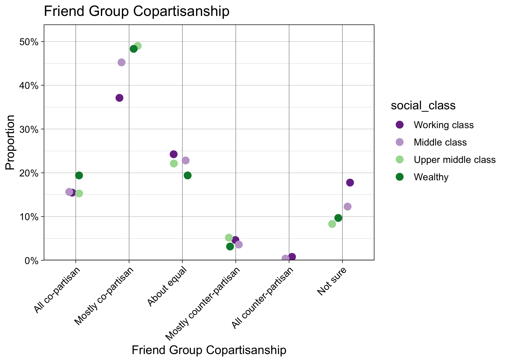

Explore Correlations with Friend Group Copartisanship
================
Aman Choudhri
2024-09-09

``` r
CLEANED_DATA_FILENAME <- 'dat/processed.rds'

df <- readRDS(CLEANED_DATA_FILENAME)
```

Save some instance variables for use in the notebook based on the
specified plot variable, `friend_group_copartisanship`.

``` r
outcome_var <- params$categorical_var
outcome_var_name <- params$cat_var_display_name
```

Also, since we’ll be using these parameters over and over again, define
a helper function so we don’t have to repeat code. For more information
on the `bar_plot_base` function, see the appendix at the bottom.

``` r
bar_plot <- function (group_var1, group_var2=NULL) {
  return(bar_plot_base(df, outcome_var, outcome_var_name, group_var1, group_var2))
}
dot_plot <- function (group_var1, group_var2=NULL) {
  return(dot_plot_base(df, outcome_var, outcome_var_name, group_var1, group_var2))
}
```

## By Personal Party ID

Start by plotting `friend_group_copartisanship` by a person’s individual
party ID.

``` r
bar_plot('collapsed_pid')
```

<!-- -->

Revisualize in dot plot format if the outcome measure supports it.

``` r
should_display_dot <- outcome_var == "friend_group_copartisanship" || outcome_var == "friend_group_class"
```

``` r
dot_plot('collapsed_pid')
```

<!-- -->

## Self-Reported Social Class

``` r
dot_plot('social_class')
```

<!-- -->

## By Urbanicity

We’ll repeat the same plot, now by urbanicity.

``` r
bar_plot('urbancity')
```

<!-- -->

## Personal Party ID and Urbanicity

Now let’s interact personal PID and urbanicity.

``` r
bar_plot('collapsed_pid', 'urbancity')
```

<!-- -->

## By State Partisan Leaning

Let’s create a rough analysis by state. Splitting states into D, R, and
swing, we’ll again display the proportions of friend group party ID.
We’ll use data from the Cook Political Report. To simplify the analysis,
we won’t consider the congressional districts in Maine and Nebraska
separately. We mark Maine as D, and Nebraska as R.

``` r
cook_ratings <- read.csv('dat/cook_political_report_ratings.csv')

# remove maine and nebraska's congressional districts
cook_ratings <- cook_ratings[cook_ratings$state %in% state.name,]

# collapse "leans" and "likelies" down to hard D/R/Tossup
cook_ratings <- cook_ratings %>%
  mutate(
    category = case_when(
      str_detect(category, "D$") ~ "Democratic",
      str_detect(category, "R$") ~ "Republican",
      TRUE ~ "Tossup"
    ) %>%
      factor(levels = c("Democratic", "Tossup", "Republican"))
  )

# add into the df
df <- merge(df, cook_ratings, by.x='inputstate', by.y='state')
# rename column
df$state_leaning <- df$category
```

First, just plot friend group PID by state leaning.

``` r
bar_plot('state_leaning')
```

<!-- -->

Now repeat, facetting once more by individual PID as well.

``` r
bar_plot('collapsed_pid', 'state_leaning')
```

<!-- -->

``` r
dot_plot('collapsed_pid', 'state_leaning')
```

<!-- -->

## By County Partisan Leaning

In `process-data.R`, we impute county information based on the ZIP code
in which the respondent said they currently lived.

We split them into D, R, and swing based on their vote proportions in
the 2020 election. Note: Alaska and Rhode island do NOT have sub-state
level vote share information available from the MIT election lab, so we
treat the whole state as “County”.

``` r
# created in `county_leanings.Rmd`
county_leanings <- read.csv('dat/county-partisan-leanings.csv')
county_leanings
```

    ##       X    state  county_name population total_votes proportion_democrat tercile
    ## 1     1  ALABAMA      AUTAUGA      58805       27341          0.27442303       1
    ## 2     2  ALABAMA      BALDWIN     231767      108122          0.22731729       1
    ## 3     3  ALABAMA      BARBOUR      25223       10438          0.46139107       0
    ## 4     4  ALABAMA         BIBB      22293        9511          0.20881085       1
    ## 5     5  ALABAMA       BLOUNT      59134       27351          0.09652298       1
    ## 6     6  ALABAMA      BULLOCK      10357        4592          0.75043554      -1
    ## 7     7  ALABAMA       BUTLER      19051        9423          0.42077895       1
    ## 8     8  ALABAMA      CALHOUN     116441       50317          0.30240277       1
    ## 9     9  ALABAMA     CHAMBERS      34772       15118          0.42102130       1
    ## 10   10  ALABAMA     CHEROKEE      24971       12207          0.13303842       1
    ## 11   11  ALABAMA      CHILTON      45014       19158          0.16040296       1
    ## 12   12  ALABAMA      CHOCTAW      12665        7423          0.42125825       1
    ## 13   13  ALABAMA       CLARKE      23087       13079          0.44001835       1
    ## 14   14  ALABAMA         CLAY      14236        6868          0.18447874       1
    ## 15   15  ALABAMA     CLEBURNE      15056        7159          0.09428691       1
    ## 16   16  ALABAMA       COFFEE      53465       21975          0.23098976       1
    ## 17   17  ALABAMA      COLBERT      57227       27546          0.30287519       1
    ## 18   18  ALABAMA      CONECUH      11597        6408          0.46285893       0
    ## 19   19  ALABAMA        COOSA      10387        5427          0.33093790       1
    ## 20   20  ALABAMA    COVINGTON      37570       17307          0.15721962       1
    ## 21   21  ALABAMA     CRENSHAW      13194        6564          0.25898842       1
    ## 22   22  ALABAMA      CULLMAN      87866       41358          0.10827409       1
    ## 23   23  ALABAMA         DALE      49326       19473          0.26549581       1
    ## 24   24  ALABAMA       DALLAS      38462       17754          0.68885885      -1
    ## 25   25  ALABAMA       DEKALB      71608       29048          0.14737676       1
    ## 26   26  ALABAMA       ELMORE      87977       40531          0.25577953       1
    ## 27   27  ALABAMA     ESCAMBIA      36757       15787          0.31152214       1
    ## 28   28  ALABAMA       ETOWAH     103436       47095          0.24560994       1
    ## 29   29  ALABAMA      FAYETTE      16321        8695          0.16043703       1
    ## 30   30  ALABAMA     FRANKLIN      32113       12462          0.16738886       1
    ## 31   31  ALABAMA       GENEVA      26659       12443          0.12818452       1
    ## 32   32  ALABAMA       GREENE       7730        4759          0.81613784      -1
    ## 33   33  ALABAMA         HALE      14785        7855          0.59363463      -1
    ## 34   34  ALABAMA        HENRY      17146        9213          0.28286117       1
    ## 35   35  ALABAMA      HOUSTON     107202       45535          0.28367190       1
    ## 36   36  ALABAMA      JACKSON      52579       23387          0.15893445       1
    ## 37   37  ALABAMA    JEFFERSON     674721      320531          0.56683441      -1
    ## 38   38  ALABAMA        LAMAR      13972        7152          0.13674497       1
    ## 39   39  ALABAMA   LAUDERDALE      93564       43636          0.27305436       1
    ## 40   40  ALABAMA     LAWRENCE      33073       15884          0.22425082       1
    ## 41   41  ALABAMA          LEE     174241       70081          0.39753999       1
    ## 42   42  ALABAMA    LIMESTONE     103570       48312          0.28299387       1
    ## 43   43  ALABAMA      LOWNDES      10311        6808          0.73031727      -1
    ## 44   44  ALABAMA        MACON      19532        8649          0.82182911      -1
    ## 45   45  ALABAMA      MADISON     388153      190066          0.45924047       0
    ## 46   46  ALABAMA      MARENGO      19323       10831          0.50669375       0
    ## 47   47  ALABAMA       MARION      29341       13668          0.10703834       1
    ## 48   48  ALABAMA     MARSHALL      97612       39134          0.15186283       1
    ## 49   49  ALABAMA       MOBILE     414809      180717          0.43977047       1
    ## 50   50  ALABAMA       MONROE      19772       10602          0.42020374       1
    ## 51   51  ALABAMA   MONTGOMERY     228954       97840          0.65953598      -1
    ## 52   52  ALABAMA       MORGAN     123421       52898          0.25017959       1
    ## 53   53  ALABAMA        PERRY       8511        5199          0.74245047      -1
    ## 54   54  ALABAMA      PICKENS      19123        9616          0.41826123       1
    ## 55   55  ALABAMA         PIKE      33009       13678          0.41204855       1
    ## 56   56  ALABAMA     RANDOLPH      21967       10762          0.20470173       1
    ## 57   57  ALABAMA      RUSSELL      59183       21092          0.53233453       0
    ## 58   58  ALABAMA       SHELBY     223024      112968          0.29449048       1
    ## 59   59  ALABAMA     ST CLAIR      91103       43910          0.17636074       1
    ## 60   60  ALABAMA       SUMTER      12345        6246          0.74415626      -1
    ## 61   61  ALABAMA    TALLADEGA      82149       35373          0.37141322       1
    ## 62   62  ALABAMA   TALLAPOOSA      41311       20822          0.28138507       1
    ## 63   63  ALABAMA   TUSCALOOSA     227036       88882          0.42488918       1
    ## 64   64  ALABAMA       WALKER      65342       30836          0.15676482       1
    ## 65   65  ALABAMA   WASHINGTON      15388        8822          0.25595103       1
    ## 66   66  ALABAMA       WILCOX      10600        5881          0.68831831      -1
    ## 67   67  ALABAMA      WINSTON      23540       11169          0.08720566       1
    ## 68   68   ALASKA                  733391      343729          0.44738151       1
    ## 69   69  ARIZONA       APACHE      66021       34735          0.67059162      -1
    ## 70   70  ARIZONA      COCHISE     125447       59289          0.40027661       1
    ## 71   71  ARIZONA     COCONINO     145101       71750          0.62296864      -1
    ## 72   72  ARIZONA         GILA      53272       27320          0.32734261       1
    ## 73   73  ARIZONA       GRAHAM      38533       14783          0.27288101       1
    ## 74   74  ARIZONA     GREENLEE       9563        3615          0.32697095       1
    ## 75   75  ARIZONA       LA PAZ      16557        7365          0.30359810       1
    ## 76   76  ARIZONA     MARICOPA    4420568     2036439          0.51107546       0
    ## 77   77  ARIZONA       MOHAVE     213267      103366          0.24022406       1
    ## 78   78  ARIZONA       NAVAJO     106717       51040          0.45813088       0
    ## 79   79  ARIZONA         PIMA    1043433      512739          0.59480749      -1
    ## 80   80  ARIZONA        PINAL     425264      182183          0.41225581       1
    ## 81   81  ARIZONA   SANTA CRUZ      47669       19332          0.67959859      -1
    ## 82   82  ARIZONA      YAVAPAI     236209      141129          0.35146568       1
    ## 83   83  ARIZONA         YUMA     203881       68744          0.46854998       0
    ## 84   84 ARKANSAS     ARKANSAS      17149        6122          0.29696178       1
    ## 85   85 ARKANSAS       ASHLEY      19062        7673          0.27694513       1
    ## 86   86 ARKANSAS       BAXTER      41627       20471          0.22641786       1
    ## 87   87 ARKANSAS       BENTON     284333      116214          0.36354484       1
    ## 88   88 ARKANSAS        BOONE      37373       16716          0.18329744       1
    ## 89   89 ARKANSAS      BRADLEY      10545        3549          0.34206819       1
    ## 90   90 ARKANSAS      CALHOUN       4739        2115          0.22647754       1
    ## 91   91 ARKANSAS      CARROLL      28260       11447          0.35144579       1
    ## 92   92 ARKANSAS       CHICOT      10208        4012          0.56331007      -1
    ## 93   93 ARKANSAS        CLARK      21446        8054          0.42686864       1
    ## 94   94 ARKANSAS         CLAY      14552        5048          0.19057052       1
    ## 95   95 ARKANSAS     CLEBURNE      24711       12316          0.16141604       1
    ## 96   96 ARKANSAS    CLEVELAND       7550        3518          0.18504832       1
    ## 97   97 ARKANSAS     COLUMBIA      22801        8314          0.33846524       1
    ## 98   98 ARKANSAS       CONWAY      20715        8309          0.31471898       1
    ## 99   99 ARKANSAS    CRAIGHEAD     111231       37479          0.31807145       1
    ## 100 100 ARKANSAS     CRAWFORD      60133       23566          0.21043028       1
    ## 101 101 ARKANSAS   CRITTENDEN      48163       15847          0.53726257       0
    ## 102 102 ARKANSAS        CROSS      16833        6718          0.26376898       1
    ## 103 103 ARKANSAS       DALLAS       6482        2536          0.37973186       1
    ## 104 104 ARKANSAS        DESHA      11395        3937          0.51206502       0
    ## 105 105 ARKANSAS         DREW      17350        6775          0.35808118       1
    ## 106 106 ARKANSAS     FAULKNER     123498       52768          0.34769178       1
    ## 107 107 ARKANSAS     FRANKLIN      17097        6977          0.18632650       1
    ## 108 108 ARKANSAS       FULTON      12075        4996          0.20716573       1
    ## 109 109 ARKANSAS      GARLAND     100180       43114          0.32576425       1
    ## 110 110 ARKANSAS        GRANT      17958        8062          0.15728107       1
    ## 111 111 ARKANSAS       GREENE      45736       15728          0.19443032       1
    ## 112 112 ARKANSAS    HEMPSTEAD      20065        6608          0.32354722       1
    ## 113 113 ARKANSAS   HOT SPRING      33040       12284          0.25089547       1
    ## 114 114 ARKANSAS       HOWARD      12785        4707          0.28468239       1
    ## 115 115 ARKANSAS INDEPENDENCE      37938       14056          0.19963005       1
    ## 116 116 ARKANSAS        IZARD      13577        5652          0.18064402       1
    ## 117 117 ARKANSAS      JACKSON      16755        4958          0.27531263       1
    ## 118 118 ARKANSAS    JEFFERSON      67260       24502          0.61141948      -1
    ## 119 119 ARKANSAS      JOHNSON      25749        9221          0.24758703       1
    ## 120 120 ARKANSAS    LAFAYETTE       6308        2596          0.32318952       1
    ## 121 121 ARKANSAS     LAWRENCE      16216        5649          0.19118428       1
    ## 122 122 ARKANSAS          LEE       8600        2709          0.52528608       0
    ## 123 123 ARKANSAS      LINCOLN      12941        3761          0.27439511       1
    ## 124 124 ARKANSAS LITTLE RIVER      12026        4941          0.24812791       1
    ## 125 125 ARKANSAS        LOGAN      21131        7985          0.19336255       1
    ## 126 126 ARKANSAS       LONOKE      74015       29570          0.22610754       1
    ## 127 127 ARKANSAS      MADISON      16521        7221          0.21645201       1
    ## 128 128 ARKANSAS       MARION      16826        7314          0.20932458       1
    ## 129 129 ARKANSAS       MILLER      42600       16165          0.26260439       1
    ## 130 130 ARKANSAS  MISSISSIPPI      40685       11854          0.38451156       1
    ## 131 131 ARKANSAS       MONROE       6799        2692          0.42607727       1
    ## 132 132 ARKANSAS   MONTGOMERY       8484        3777          0.19353985       1
    ## 133 133 ARKANSAS       NEVADA       8310        3209          0.33530695       1
    ## 134 134 ARKANSAS       NEWTON       7225        3901          0.18174827       1
    ## 135 135 ARKANSAS     OUACHITA      22650        9289          0.43007859       1
    ## 136 136 ARKANSAS        PERRY      10019        4491          0.22533957       1
    ## 137 137 ARKANSAS     PHILLIPS      16568        6040          0.59983444      -1
    ## 138 138 ARKANSAS         PIKE      10171        4163          0.15469613       1
    ## 139 139 ARKANSAS     POINSETT      22965        7342          0.19395260       1
    ## 140 140 ARKANSAS         POLK      19221        8281          0.15046492       1
    ## 141 141 ARKANSAS         POPE      63381       23853          0.24198214       1
    ## 142 142 ARKANSAS      PRAIRIE       8282        3440          0.19011628       1
    ##  [ reached 'max' / getOption("max.print") -- omitted 2793 rows ]

``` r
# merge these `terciles` in based on state and county name
df <- df %>% mutate(state_upper = toupper(inputstate), county_upper=toupper(county)) %>%
  left_join(
    county_leanings,
    by=c("state_upper"="state", "county_upper"="county_name")
  )

county_leaning_labels <- paste(c("Democrat", "Swing", "Republican"), "County")
df$county_leaning <- factor(county_leaning_labels[df$tercile + 2], levels=county_leaning_labels)
```

``` r
df %>% select(inputstate, collapsed_pid, state_upper, county_upper, proportion_democrat, county_leaning)
```

    ##     inputstate        collapsed_pid state_upper        county_upper proportion_democrat    county_leaning
    ## 1      Alabama             Democrat     ALABAMA              MOBILE          0.43977047 Republican County
    ## 2      Alabama Independent/Not sure     ALABAMA             CALHOUN          0.30240277 Republican County
    ## 3      Alabama           Republican     ALABAMA           JEFFERSON          0.56683441   Democrat County
    ## 4      Alabama             Democrat     ALABAMA            MARSHALL          0.15186283 Republican County
    ## 5      Alabama           Republican     ALABAMA                DALE          0.26549581 Republican County
    ## 6      Alabama             Democrat     ALABAMA              GENEVA          0.12818452 Republican County
    ## 7      Alabama Independent/Not sure     ALABAMA              ETOWAH          0.24560994 Republican County
    ## 8      Alabama           Republican     ALABAMA           ST. CLAIR                  NA              <NA>
    ## 9      Alabama             Democrat     ALABAMA              MOBILE          0.43977047 Republican County
    ## 10     Alabama             Democrat     ALABAMA             MADISON          0.45924047      Swing County
    ## 11     Alabama           Republican     ALABAMA           JEFFERSON          0.56683441   Democrat County
    ## 12     Alabama             Democrat     ALABAMA          MONTGOMERY          0.65953598   Democrat County
    ## 13     Alabama Independent/Not sure     ALABAMA             MARENGO          0.50669375      Swing County
    ## 14     Alabama             Democrat     ALABAMA              BUTLER          0.42077895 Republican County
    ## 15     Alabama Independent/Not sure     ALABAMA             MADISON          0.45924047      Swing County
    ## 16     Alabama             Democrat     ALABAMA          MONTGOMERY          0.65953598   Democrat County
    ## 17     Alabama           Republican     ALABAMA          WASHINGTON          0.25595103 Republican County
    ## 18     Alabama             Democrat     ALABAMA              BLOUNT          0.09652298 Republican County
    ## 19     Alabama           Republican     ALABAMA              ETOWAH          0.24560994 Republican County
    ## 20     Alabama Independent/Not sure     ALABAMA              DEKALB          0.14737676 Republican County
    ## 21     Alabama             Democrat     ALABAMA             BALDWIN          0.22731729 Republican County
    ## 22     Alabama           Republican     ALABAMA             MADISON          0.45924047      Swing County
    ## 23     Alabama Independent/Not sure     ALABAMA             COLBERT          0.30287519 Republican County
    ## 24     Alabama           Republican     ALABAMA          MONTGOMERY          0.65953598   Democrat County
    ## 25     Alabama Independent/Not sure     ALABAMA          MONTGOMERY          0.65953598   Democrat County
    ## 26     Alabama           Republican     ALABAMA          TUSCALOOSA          0.42488918 Republican County
    ## 27     Alabama           Republican     ALABAMA           JEFFERSON          0.56683441   Democrat County
    ## 28     Alabama             Democrat     ALABAMA             MADISON          0.45924047      Swing County
    ## 29     Alabama             Democrat     ALABAMA                <NA>                  NA              <NA>
    ## 30     Alabama             Democrat     ALABAMA             COLBERT          0.30287519 Republican County
    ## 31     Alabama           Republican     ALABAMA            CHAMBERS          0.42102130 Republican County
    ## 32     Alabama             Democrat     ALABAMA           JEFFERSON          0.56683441   Democrat County
    ## 33     Alabama             Democrat     ALABAMA             MADISON          0.45924047      Swing County
    ## 34     Alabama             Democrat     ALABAMA             CULLMAN          0.10827409 Republican County
    ## 35     Alabama             Democrat     ALABAMA             JACKSON          0.15893445 Republican County
    ## 36     Alabama             Democrat     ALABAMA                HALE          0.59363463   Democrat County
    ## 37     Alabama           Republican     ALABAMA                 LEE          0.39753999 Republican County
    ## 38     Alabama           Republican     ALABAMA              MOBILE          0.43977047 Republican County
    ## 39     Alabama             Democrat     ALABAMA             MADISON          0.45924047      Swing County
    ## 40     Alabama           Republican     ALABAMA             BALDWIN          0.22731729 Republican County
    ## 41     Alabama           Republican     ALABAMA           LIMESTONE          0.28299387 Republican County
    ## 42     Alabama           Republican     ALABAMA             RUSSELL          0.53233453      Swing County
    ## 43     Alabama           Republican     ALABAMA             MADISON          0.45924047      Swing County
    ## 44     Alabama           Republican     ALABAMA              ETOWAH          0.24560994 Republican County
    ## 45     Alabama           Republican     ALABAMA             CALHOUN          0.30240277 Republican County
    ## 46     Alabama           Republican     ALABAMA              ELMORE          0.25577953 Republican County
    ## 47     Alabama           Republican     ALABAMA              MOBILE          0.43977047 Republican County
    ## 48     Alabama             Democrat     ALABAMA           JEFFERSON          0.56683441   Democrat County
    ## 49     Alabama             Democrat     ALABAMA           JEFFERSON          0.56683441   Democrat County
    ## 50     Alabama Independent/Not sure     ALABAMA             MADISON          0.45924047      Swing County
    ## 51     Alabama           Republican     ALABAMA            ESCAMBIA          0.31152214 Republican County
    ## 52     Alabama             Democrat     ALABAMA           LIMESTONE          0.28299387 Republican County
    ## 53     Alabama             Democrat     ALABAMA             MADISON          0.45924047      Swing County
    ## 54     Alabama             Democrat     ALABAMA             MADISON          0.45924047      Swing County
    ## 55     Alabama Independent/Not sure     ALABAMA           JEFFERSON          0.56683441   Democrat County
    ## 56     Alabama           Republican     ALABAMA             MADISON          0.45924047      Swing County
    ## 57     Alabama             Democrat     ALABAMA              SHELBY          0.29449048 Republican County
    ## 58     Alabama           Republican     ALABAMA               LAMAR          0.13674497 Republican County
    ## 59     Alabama             Democrat     ALABAMA              CLARKE          0.44001835 Republican County
    ## 60     Alabama Independent/Not sure     ALABAMA             BALDWIN          0.22731729 Republican County
    ## 61     Alabama           Republican     ALABAMA             HOUSTON          0.28367190 Republican County
    ## 62     Alabama             Democrat     ALABAMA              SHELBY          0.29449048 Republican County
    ## 63     Alabama           Republican     ALABAMA             MADISON          0.45924047      Swing County
    ## 64     Alabama           Republican     ALABAMA             CULLMAN          0.10827409 Republican County
    ## 65     Alabama             Democrat     ALABAMA             MADISON          0.45924047      Swing County
    ## 66     Alabama           Republican     ALABAMA              MOBILE          0.43977047 Republican County
    ## 67     Alabama Independent/Not sure     ALABAMA                 LEE          0.39753999 Republican County
    ## 68     Alabama             Democrat     ALABAMA          MONTGOMERY          0.65953598   Democrat County
    ## 69     Alabama             Democrat     ALABAMA           JEFFERSON          0.56683441   Democrat County
    ## 70     Alabama           Republican     ALABAMA          MONTGOMERY          0.65953598   Democrat County
    ## 71     Alabama           Republican     ALABAMA                <NA>                  NA              <NA>
    ## 72     Alabama           Republican     ALABAMA              ELMORE          0.25577953 Republican County
    ## 73      Alaska Independent/Not sure      ALASKA SOUTHEAST FAIRBANKS                  NA              <NA>
    ## 74      Alaska           Republican      ALASKA           ANCHORAGE                  NA              <NA>
    ## 75      Alaska           Republican      ALASKA           ANCHORAGE                  NA              <NA>
    ## 76      Alaska             Democrat      ALASKA          PETERSBURG                  NA              <NA>
    ## 77      Alaska Independent/Not sure      ALASKA           ANCHORAGE                  NA              <NA>
    ## 78      Alaska             Democrat      ALASKA              JUNEAU                  NA              <NA>
    ## 79      Alaska             Democrat      ALASKA   MATANUSKA-SUSITNA                  NA              <NA>
    ## 80      Alaska             Democrat      ALASKA              JUNEAU                  NA              <NA>
    ## 81      Alaska Independent/Not sure      ALASKA           ANCHORAGE                  NA              <NA>
    ## 82      Alaska           Republican      ALASKA     KENAI PENINSULA                  NA              <NA>
    ## 83      Alaska             Democrat      ALASKA   MATANUSKA-SUSITNA                  NA              <NA>
    ## 84     Arizona           Republican     ARIZONA                PIMA          0.59480749   Democrat County
    ## 85     Arizona Independent/Not sure     ARIZONA                GILA          0.32734261 Republican County
    ## 86     Arizona           Republican     ARIZONA              GRAHAM          0.27288101 Republican County
    ## 87     Arizona           Republican     ARIZONA            MARICOPA          0.51107546      Swing County
    ## 88     Arizona Independent/Not sure     ARIZONA             YAVAPAI          0.35146568 Republican County
    ## 89     Arizona             Democrat     ARIZONA            MARICOPA          0.51107546      Swing County
    ## 90     Arizona           Republican     ARIZONA                PIMA          0.59480749   Democrat County
    ## 91     Arizona           Republican     ARIZONA              MOHAVE          0.24022406 Republican County
    ## 92     Arizona           Republican     ARIZONA               PINAL          0.41225581 Republican County
    ## 93     Arizona           Republican     ARIZONA               PINAL          0.41225581 Republican County
    ## 94     Arizona           Republican     ARIZONA            MARICOPA          0.51107546      Swing County
    ## 95     Arizona             Democrat     ARIZONA            MARICOPA          0.51107546      Swing County
    ## 96     Arizona Independent/Not sure     ARIZONA            MARICOPA          0.51107546      Swing County
    ## 97     Arizona           Republican     ARIZONA                PIMA          0.59480749   Democrat County
    ## 98     Arizona           Republican     ARIZONA            MARICOPA          0.51107546      Swing County
    ## 99     Arizona           Republican     ARIZONA            MARICOPA          0.51107546      Swing County
    ## 100    Arizona           Republican     ARIZONA                PIMA          0.59480749   Democrat County
    ## 101    Arizona             Democrat     ARIZONA            MARICOPA          0.51107546      Swing County
    ## 102    Arizona           Republican     ARIZONA            MARICOPA          0.51107546      Swing County
    ## 103    Arizona Independent/Not sure     ARIZONA                PIMA          0.59480749   Democrat County
    ## 104    Arizona           Republican     ARIZONA               PINAL          0.41225581 Republican County
    ## 105    Arizona             Democrat     ARIZONA            MARICOPA          0.51107546      Swing County
    ## 106    Arizona           Republican     ARIZONA            MARICOPA          0.51107546      Swing County
    ## 107    Arizona             Democrat     ARIZONA                PIMA          0.59480749   Democrat County
    ## 108    Arizona             Democrat     ARIZONA                PIMA          0.59480749   Democrat County
    ## 109    Arizona           Republican     ARIZONA            MARICOPA          0.51107546      Swing County
    ## 110    Arizona           Republican     ARIZONA            MARICOPA          0.51107546      Swing County
    ## 111    Arizona           Republican     ARIZONA             YAVAPAI          0.35146568 Republican County
    ## 112    Arizona             Democrat     ARIZONA               PINAL          0.41225581 Republican County
    ## 113    Arizona             Democrat     ARIZONA            MARICOPA          0.51107546      Swing County
    ## 114    Arizona           Republican     ARIZONA            MARICOPA          0.51107546      Swing County
    ## 115    Arizona Independent/Not sure     ARIZONA            COCONINO          0.62296864   Democrat County
    ## 116    Arizona           Republican     ARIZONA            MARICOPA          0.51107546      Swing County
    ## 117    Arizona           Republican     ARIZONA            MARICOPA          0.51107546      Swing County
    ## 118    Arizona Independent/Not sure     ARIZONA                PIMA          0.59480749   Democrat County
    ## 119    Arizona             Democrat     ARIZONA            MARICOPA          0.51107546      Swing County
    ## 120    Arizona           Republican     ARIZONA             YAVAPAI          0.35146568 Republican County
    ## 121    Arizona           Republican     ARIZONA            MARICOPA          0.51107546      Swing County
    ## 122    Arizona             Democrat     ARIZONA                PIMA          0.59480749   Democrat County
    ## 123    Arizona Independent/Not sure     ARIZONA            MARICOPA          0.51107546      Swing County
    ## 124    Arizona             Democrat     ARIZONA            MARICOPA          0.51107546      Swing County
    ## 125    Arizona Independent/Not sure     ARIZONA            MARICOPA          0.51107546      Swing County
    ## 126    Arizona             Democrat     ARIZONA            MARICOPA          0.51107546      Swing County
    ## 127    Arizona           Republican     ARIZONA             YAVAPAI          0.35146568 Republican County
    ## 128    Arizona             Democrat     ARIZONA            MARICOPA          0.51107546      Swing County
    ## 129    Arizona             Democrat     ARIZONA            MARICOPA          0.51107546      Swing County
    ## 130    Arizona Independent/Not sure     ARIZONA              MOHAVE          0.24022406 Republican County
    ## 131    Arizona             Democrat     ARIZONA            MARICOPA          0.51107546      Swing County
    ## 132    Arizona           Republican     ARIZONA            MARICOPA          0.51107546      Swing County
    ## 133    Arizona Independent/Not sure     ARIZONA             COCHISE          0.40027661 Republican County
    ## 134    Arizona             Democrat     ARIZONA             COCHISE          0.40027661 Republican County
    ## 135    Arizona             Democrat     ARIZONA                PIMA          0.59480749   Democrat County
    ## 136    Arizona           Republican     ARIZONA            MARICOPA          0.51107546      Swing County
    ## 137    Arizona             Democrat     ARIZONA            MARICOPA          0.51107546      Swing County
    ## 138    Arizona             Democrat     ARIZONA                PIMA          0.59480749   Democrat County
    ## 139    Arizona Independent/Not sure     ARIZONA            MARICOPA          0.51107546      Swing County
    ## 140    Arizona             Democrat     ARIZONA               PINAL          0.41225581 Republican County
    ## 141    Arizona             Democrat     ARIZONA                PIMA          0.59480749   Democrat County
    ## 142    Arizona             Democrat     ARIZONA                YUMA          0.46854998      Swing County
    ## 143    Arizona           Republican     ARIZONA            MARICOPA          0.51107546      Swing County
    ## 144    Arizona Independent/Not sure     ARIZONA            MARICOPA          0.51107546      Swing County
    ## 145    Arizona           Republican     ARIZONA            MARICOPA          0.51107546      Swing County
    ## 146    Arizona Independent/Not sure     ARIZONA            MARICOPA          0.51107546      Swing County
    ## 147    Arizona             Democrat     ARIZONA            MARICOPA          0.51107546      Swing County
    ## 148    Arizona             Democrat     ARIZONA               PINAL          0.41225581 Republican County
    ## 149    Arizona             Democrat     ARIZONA                PIMA          0.59480749   Democrat County
    ## 150    Arizona             Democrat     ARIZONA            MARICOPA          0.51107546      Swing County
    ## 151    Arizona           Republican     ARIZONA            MARICOPA          0.51107546      Swing County
    ## 152    Arizona           Republican     ARIZONA               PINAL          0.41225581 Republican County
    ## 153    Arizona             Democrat     ARIZONA            MARICOPA          0.51107546      Swing County
    ## 154    Arizona           Republican     ARIZONA            MARICOPA          0.51107546      Swing County
    ## 155    Arizona Independent/Not sure     ARIZONA            MARICOPA          0.51107546      Swing County
    ## 156    Arizona           Republican     ARIZONA            MARICOPA          0.51107546      Swing County
    ## 157    Arizona           Republican     ARIZONA               PINAL          0.41225581 Republican County
    ## 158    Arizona Independent/Not sure     ARIZONA            MARICOPA          0.51107546      Swing County
    ## 159    Arizona Independent/Not sure     ARIZONA                <NA>                  NA              <NA>
    ## 160    Arizona             Democrat     ARIZONA            MARICOPA          0.51107546      Swing County
    ## 161    Arizona           Republican     ARIZONA            MARICOPA          0.51107546      Swing County
    ## 162    Arizona Independent/Not sure     ARIZONA            MARICOPA          0.51107546      Swing County
    ## 163    Arizona             Democrat     ARIZONA            MARICOPA          0.51107546      Swing County
    ## 164    Arizona             Democrat     ARIZONA            MARICOPA          0.51107546      Swing County
    ## 165    Arizona Independent/Not sure     ARIZONA            MARICOPA          0.51107546      Swing County
    ## 166    Arizona             Democrat     ARIZONA            MARICOPA          0.51107546      Swing County
    ##  [ reached 'max' / getOption("max.print") -- omitted 5613 rows ]

``` r
bar_plot('county_leaning')
```

<!-- -->

``` r
bar_plot('collapsed_pid', 'county_leaning')
```

<!-- -->

``` r
dot_plot('collapsed_pid', 'county_leaning')
```

<!-- -->

``` r
copartisanship_mapping <- paste(c("Co-partisan", "Swing", "Counter-partisan"), "County")
df$county_copartisanship <- ifelse(
  df$collapsed_pid == "Democrat",
  copartisanship_mapping[df$tercile + 2],
  rev(copartisanship_mapping)[df$tercile + 2]
)
df$county_copartisanship <- factor(df$county_copartisanship, levels=copartisanship_mapping)
df[df$collapsed_pid == "Independent/Not sure", "county_copartisanship"] <- NA

df %>% select(collapsed_pid, county_leaning, county_copartisanship)
```

    ##            collapsed_pid    county_leaning   county_copartisanship
    ## 1               Democrat Republican County Counter-partisan County
    ## 2   Independent/Not sure Republican County                    <NA>
    ## 3             Republican   Democrat County Counter-partisan County
    ## 4               Democrat Republican County Counter-partisan County
    ## 5             Republican Republican County      Co-partisan County
    ## 6               Democrat Republican County Counter-partisan County
    ## 7   Independent/Not sure Republican County                    <NA>
    ## 8             Republican              <NA>                    <NA>
    ## 9               Democrat Republican County Counter-partisan County
    ## 10              Democrat      Swing County            Swing County
    ## 11            Republican   Democrat County Counter-partisan County
    ## 12              Democrat   Democrat County      Co-partisan County
    ## 13  Independent/Not sure      Swing County                    <NA>
    ## 14              Democrat Republican County Counter-partisan County
    ## 15  Independent/Not sure      Swing County                    <NA>
    ## 16              Democrat   Democrat County      Co-partisan County
    ## 17            Republican Republican County      Co-partisan County
    ## 18              Democrat Republican County Counter-partisan County
    ## 19            Republican Republican County      Co-partisan County
    ## 20  Independent/Not sure Republican County                    <NA>
    ## 21              Democrat Republican County Counter-partisan County
    ## 22            Republican      Swing County            Swing County
    ## 23  Independent/Not sure Republican County                    <NA>
    ## 24            Republican   Democrat County Counter-partisan County
    ## 25  Independent/Not sure   Democrat County                    <NA>
    ## 26            Republican Republican County      Co-partisan County
    ## 27            Republican   Democrat County Counter-partisan County
    ## 28              Democrat      Swing County            Swing County
    ## 29              Democrat              <NA>                    <NA>
    ## 30              Democrat Republican County Counter-partisan County
    ## 31            Republican Republican County      Co-partisan County
    ## 32              Democrat   Democrat County      Co-partisan County
    ## 33              Democrat      Swing County            Swing County
    ## 34              Democrat Republican County Counter-partisan County
    ## 35              Democrat Republican County Counter-partisan County
    ## 36              Democrat   Democrat County      Co-partisan County
    ## 37            Republican Republican County      Co-partisan County
    ## 38            Republican Republican County      Co-partisan County
    ## 39              Democrat      Swing County            Swing County
    ## 40            Republican Republican County      Co-partisan County
    ## 41            Republican Republican County      Co-partisan County
    ## 42            Republican      Swing County            Swing County
    ## 43            Republican      Swing County            Swing County
    ## 44            Republican Republican County      Co-partisan County
    ## 45            Republican Republican County      Co-partisan County
    ## 46            Republican Republican County      Co-partisan County
    ## 47            Republican Republican County      Co-partisan County
    ## 48              Democrat   Democrat County      Co-partisan County
    ## 49              Democrat   Democrat County      Co-partisan County
    ## 50  Independent/Not sure      Swing County                    <NA>
    ## 51            Republican Republican County      Co-partisan County
    ## 52              Democrat Republican County Counter-partisan County
    ## 53              Democrat      Swing County            Swing County
    ## 54              Democrat      Swing County            Swing County
    ## 55  Independent/Not sure   Democrat County                    <NA>
    ## 56            Republican      Swing County            Swing County
    ## 57              Democrat Republican County Counter-partisan County
    ## 58            Republican Republican County      Co-partisan County
    ## 59              Democrat Republican County Counter-partisan County
    ## 60  Independent/Not sure Republican County                    <NA>
    ## 61            Republican Republican County      Co-partisan County
    ## 62              Democrat Republican County Counter-partisan County
    ## 63            Republican      Swing County            Swing County
    ## 64            Republican Republican County      Co-partisan County
    ## 65              Democrat      Swing County            Swing County
    ## 66            Republican Republican County      Co-partisan County
    ## 67  Independent/Not sure Republican County                    <NA>
    ## 68              Democrat   Democrat County      Co-partisan County
    ## 69              Democrat   Democrat County      Co-partisan County
    ## 70            Republican   Democrat County Counter-partisan County
    ## 71            Republican              <NA>                    <NA>
    ## 72            Republican Republican County      Co-partisan County
    ## 73  Independent/Not sure              <NA>                    <NA>
    ## 74            Republican              <NA>                    <NA>
    ## 75            Republican              <NA>                    <NA>
    ## 76              Democrat              <NA>                    <NA>
    ## 77  Independent/Not sure              <NA>                    <NA>
    ## 78              Democrat              <NA>                    <NA>
    ## 79              Democrat              <NA>                    <NA>
    ## 80              Democrat              <NA>                    <NA>
    ## 81  Independent/Not sure              <NA>                    <NA>
    ## 82            Republican              <NA>                    <NA>
    ## 83              Democrat              <NA>                    <NA>
    ## 84            Republican   Democrat County Counter-partisan County
    ## 85  Independent/Not sure Republican County                    <NA>
    ## 86            Republican Republican County      Co-partisan County
    ## 87            Republican      Swing County            Swing County
    ## 88  Independent/Not sure Republican County                    <NA>
    ## 89              Democrat      Swing County            Swing County
    ## 90            Republican   Democrat County Counter-partisan County
    ## 91            Republican Republican County      Co-partisan County
    ## 92            Republican Republican County      Co-partisan County
    ## 93            Republican Republican County      Co-partisan County
    ## 94            Republican      Swing County            Swing County
    ## 95              Democrat      Swing County            Swing County
    ## 96  Independent/Not sure      Swing County                    <NA>
    ## 97            Republican   Democrat County Counter-partisan County
    ## 98            Republican      Swing County            Swing County
    ## 99            Republican      Swing County            Swing County
    ## 100           Republican   Democrat County Counter-partisan County
    ## 101             Democrat      Swing County            Swing County
    ## 102           Republican      Swing County            Swing County
    ## 103 Independent/Not sure   Democrat County                    <NA>
    ## 104           Republican Republican County      Co-partisan County
    ## 105             Democrat      Swing County            Swing County
    ## 106           Republican      Swing County            Swing County
    ## 107             Democrat   Democrat County      Co-partisan County
    ## 108             Democrat   Democrat County      Co-partisan County
    ## 109           Republican      Swing County            Swing County
    ## 110           Republican      Swing County            Swing County
    ## 111           Republican Republican County      Co-partisan County
    ## 112             Democrat Republican County Counter-partisan County
    ## 113             Democrat      Swing County            Swing County
    ## 114           Republican      Swing County            Swing County
    ## 115 Independent/Not sure   Democrat County                    <NA>
    ## 116           Republican      Swing County            Swing County
    ## 117           Republican      Swing County            Swing County
    ## 118 Independent/Not sure   Democrat County                    <NA>
    ## 119             Democrat      Swing County            Swing County
    ## 120           Republican Republican County      Co-partisan County
    ## 121           Republican      Swing County            Swing County
    ## 122             Democrat   Democrat County      Co-partisan County
    ## 123 Independent/Not sure      Swing County                    <NA>
    ## 124             Democrat      Swing County            Swing County
    ## 125 Independent/Not sure      Swing County                    <NA>
    ## 126             Democrat      Swing County            Swing County
    ## 127           Republican Republican County      Co-partisan County
    ## 128             Democrat      Swing County            Swing County
    ## 129             Democrat      Swing County            Swing County
    ## 130 Independent/Not sure Republican County                    <NA>
    ## 131             Democrat      Swing County            Swing County
    ## 132           Republican      Swing County            Swing County
    ## 133 Independent/Not sure Republican County                    <NA>
    ## 134             Democrat Republican County Counter-partisan County
    ## 135             Democrat   Democrat County      Co-partisan County
    ## 136           Republican      Swing County            Swing County
    ## 137             Democrat      Swing County            Swing County
    ## 138             Democrat   Democrat County      Co-partisan County
    ## 139 Independent/Not sure      Swing County                    <NA>
    ## 140             Democrat Republican County Counter-partisan County
    ## 141             Democrat   Democrat County      Co-partisan County
    ## 142             Democrat      Swing County            Swing County
    ## 143           Republican      Swing County            Swing County
    ## 144 Independent/Not sure      Swing County                    <NA>
    ## 145           Republican      Swing County            Swing County
    ## 146 Independent/Not sure      Swing County                    <NA>
    ## 147             Democrat      Swing County            Swing County
    ## 148             Democrat Republican County Counter-partisan County
    ## 149             Democrat   Democrat County      Co-partisan County
    ## 150             Democrat      Swing County            Swing County
    ## 151           Republican      Swing County            Swing County
    ## 152           Republican Republican County      Co-partisan County
    ## 153             Democrat      Swing County            Swing County
    ## 154           Republican      Swing County            Swing County
    ## 155 Independent/Not sure      Swing County                    <NA>
    ## 156           Republican      Swing County            Swing County
    ## 157           Republican Republican County      Co-partisan County
    ## 158 Independent/Not sure      Swing County                    <NA>
    ## 159 Independent/Not sure              <NA>                    <NA>
    ## 160             Democrat      Swing County            Swing County
    ## 161           Republican      Swing County            Swing County
    ## 162 Independent/Not sure      Swing County                    <NA>
    ## 163             Democrat      Swing County            Swing County
    ## 164             Democrat      Swing County            Swing County
    ## 165 Independent/Not sure      Swing County                    <NA>
    ## 166             Democrat      Swing County            Swing County
    ## 167           Republican      Swing County            Swing County
    ## 168           Republican      Swing County            Swing County
    ## 169             Democrat   Democrat County      Co-partisan County
    ## 170           Republican      Swing County            Swing County
    ## 171             Democrat   Democrat County      Co-partisan County
    ## 172             Democrat   Democrat County      Co-partisan County
    ## 173 Independent/Not sure Republican County                    <NA>
    ## 174             Democrat      Swing County            Swing County
    ## 175           Republican   Democrat County Counter-partisan County
    ## 176 Independent/Not sure      Swing County                    <NA>
    ## 177           Republican Republican County      Co-partisan County
    ## 178             Democrat   Democrat County      Co-partisan County
    ## 179           Republican   Democrat County Counter-partisan County
    ## 180           Republican      Swing County            Swing County
    ## 181           Republican      Swing County            Swing County
    ## 182             Democrat      Swing County            Swing County
    ## 183           Republican      Swing County            Swing County
    ## 184             Democrat   Democrat County      Co-partisan County
    ## 185           Republican      Swing County            Swing County
    ## 186 Independent/Not sure      Swing County                    <NA>
    ## 187             Democrat   Democrat County      Co-partisan County
    ## 188           Republican Republican County      Co-partisan County
    ## 189             Democrat      Swing County            Swing County
    ## 190             Democrat Republican County Counter-partisan County
    ## 191             Democrat      Swing County            Swing County
    ## 192             Democrat      Swing County            Swing County
    ## 193           Republican      Swing County            Swing County
    ## 194             Democrat   Democrat County      Co-partisan County
    ## 195             Democrat   Democrat County      Co-partisan County
    ## 196           Republican      Swing County            Swing County
    ## 197           Republican      Swing County            Swing County
    ## 198           Republican   Democrat County Counter-partisan County
    ## 199           Republican Republican County      Co-partisan County
    ## 200           Republican Republican County      Co-partisan County
    ## 201             Democrat      Swing County            Swing County
    ## 202           Republican      Swing County            Swing County
    ## 203             Democrat      Swing County            Swing County
    ## 204 Independent/Not sure Republican County                    <NA>
    ## 205           Republican Republican County      Co-partisan County
    ## 206 Independent/Not sure      Swing County                    <NA>
    ## 207           Republican      Swing County            Swing County
    ## 208             Democrat      Swing County            Swing County
    ## 209           Republican      Swing County            Swing County
    ## 210           Republican      Swing County            Swing County
    ## 211 Independent/Not sure      Swing County                    <NA>
    ## 212 Independent/Not sure      Swing County                    <NA>
    ## 213           Republican      Swing County            Swing County
    ## 214           Republican Republican County      Co-partisan County
    ## 215             Democrat Republican County Counter-partisan County
    ## 216           Republican      Swing County            Swing County
    ## 217             Democrat Republican County Counter-partisan County
    ## 218             Democrat Republican County Counter-partisan County
    ## 219           Republican Republican County      Co-partisan County
    ## 220 Independent/Not sure Republican County                    <NA>
    ## 221 Independent/Not sure Republican County                    <NA>
    ## 222           Republican      Swing County            Swing County
    ## 223           Republican      Swing County            Swing County
    ## 224             Democrat      Swing County            Swing County
    ## 225             Democrat      Swing County            Swing County
    ## 226           Republican      Swing County            Swing County
    ## 227             Democrat      Swing County            Swing County
    ## 228             Democrat      Swing County            Swing County
    ## 229             Democrat      Swing County            Swing County
    ## 230             Democrat   Democrat County      Co-partisan County
    ## 231 Independent/Not sure      Swing County                    <NA>
    ## 232             Democrat      Swing County            Swing County
    ## 233           Republican      Swing County            Swing County
    ## 234             Democrat Republican County Counter-partisan County
    ## 235           Republican      Swing County            Swing County
    ## 236 Independent/Not sure Republican County                    <NA>
    ## 237             Democrat      Swing County            Swing County
    ## 238             Democrat      Swing County            Swing County
    ## 239           Republican      Swing County            Swing County
    ## 240           Republican   Democrat County Counter-partisan County
    ## 241           Republican      Swing County            Swing County
    ## 242             Democrat      Swing County            Swing County
    ## 243             Democrat   Democrat County      Co-partisan County
    ## 244           Republican      Swing County            Swing County
    ## 245             Democrat      Swing County            Swing County
    ## 246             Democrat Republican County Counter-partisan County
    ## 247             Democrat Republican County Counter-partisan County
    ## 248           Republican Republican County      Co-partisan County
    ## 249           Republican      Swing County            Swing County
    ## 250           Republican   Democrat County Counter-partisan County
    ## 251             Democrat Republican County Counter-partisan County
    ## 252           Republican Republican County      Co-partisan County
    ## 253             Democrat Republican County Counter-partisan County
    ## 254             Democrat Republican County Counter-partisan County
    ## 255 Independent/Not sure Republican County                    <NA>
    ## 256           Republican Republican County      Co-partisan County
    ## 257 Independent/Not sure Republican County                    <NA>
    ## 258             Democrat Republican County Counter-partisan County
    ## 259           Republican Republican County      Co-partisan County
    ## 260           Republican Republican County      Co-partisan County
    ## 261 Independent/Not sure   Democrat County                    <NA>
    ## 262             Democrat Republican County Counter-partisan County
    ## 263             Democrat      Swing County            Swing County
    ## 264           Republican      Swing County            Swing County
    ## 265           Republican Republican County      Co-partisan County
    ## 266             Democrat Republican County Counter-partisan County
    ## 267           Republican      Swing County            Swing County
    ## 268             Democrat      Swing County            Swing County
    ## 269           Republican Republican County      Co-partisan County
    ## 270             Democrat Republican County Counter-partisan County
    ## 271           Republican Republican County      Co-partisan County
    ## 272             Democrat   Democrat County      Co-partisan County
    ## 273             Democrat Republican County Counter-partisan County
    ## 274           Republican Republican County      Co-partisan County
    ## 275           Republican Republican County      Co-partisan County
    ## 276             Democrat      Swing County            Swing County
    ## 277           Republican Republican County      Co-partisan County
    ## 278             Democrat Republican County Counter-partisan County
    ## 279             Democrat Republican County Counter-partisan County
    ## 280 Independent/Not sure Republican County                    <NA>
    ## 281             Democrat      Swing County            Swing County
    ## 282           Republican Republican County      Co-partisan County
    ## 283           Republican Republican County      Co-partisan County
    ## 284           Republican   Democrat County Counter-partisan County
    ## 285           Republican Republican County      Co-partisan County
    ## 286           Republican Republican County      Co-partisan County
    ## 287           Republican Republican County      Co-partisan County
    ## 288           Republican Republican County      Co-partisan County
    ## 289 Independent/Not sure Republican County                    <NA>
    ## 290             Democrat Republican County Counter-partisan County
    ## 291             Democrat Republican County Counter-partisan County
    ## 292             Democrat Republican County Counter-partisan County
    ## 293           Republican Republican County      Co-partisan County
    ## 294 Independent/Not sure   Democrat County                    <NA>
    ## 295             Democrat   Democrat County      Co-partisan County
    ## 296 Independent/Not sure   Democrat County                    <NA>
    ## 297 Independent/Not sure   Democrat County                    <NA>
    ## 298           Republican      Swing County            Swing County
    ## 299             Democrat   Democrat County      Co-partisan County
    ## 300             Democrat      Swing County            Swing County
    ## 301           Republican   Democrat County Counter-partisan County
    ## 302 Independent/Not sure   Democrat County                    <NA>
    ## 303             Democrat   Democrat County      Co-partisan County
    ## 304             Democrat   Democrat County      Co-partisan County
    ## 305             Democrat      Swing County            Swing County
    ## 306             Democrat   Democrat County      Co-partisan County
    ## 307             Democrat   Democrat County      Co-partisan County
    ## 308             Democrat   Democrat County      Co-partisan County
    ## 309             Democrat   Democrat County      Co-partisan County
    ## 310           Republican   Democrat County Counter-partisan County
    ## 311             Democrat   Democrat County      Co-partisan County
    ## 312             Democrat              <NA>                    <NA>
    ## 313             Democrat Republican County Counter-partisan County
    ## 314             Democrat   Democrat County      Co-partisan County
    ## 315           Republican   Democrat County Counter-partisan County
    ## 316             Democrat Republican County Counter-partisan County
    ## 317             Democrat      Swing County            Swing County
    ## 318             Democrat   Democrat County      Co-partisan County
    ## 319           Republican   Democrat County Counter-partisan County
    ## 320             Democrat   Democrat County      Co-partisan County
    ## 321             Democrat   Democrat County      Co-partisan County
    ## 322             Democrat   Democrat County      Co-partisan County
    ## 323           Republican   Democrat County Counter-partisan County
    ## 324             Democrat   Democrat County      Co-partisan County
    ## 325           Republican   Democrat County Counter-partisan County
    ## 326           Republican Republican County      Co-partisan County
    ## 327           Republican      Swing County            Swing County
    ## 328             Democrat   Democrat County      Co-partisan County
    ## 329             Democrat              <NA>                    <NA>
    ## 330             Democrat   Democrat County      Co-partisan County
    ## 331 Independent/Not sure   Democrat County                    <NA>
    ## 332           Republican   Democrat County Counter-partisan County
    ## 333           Republican   Democrat County Counter-partisan County
    ##  [ reached 'max' / getOption("max.print") -- omitted 5446 rows ]

``` r
dot_plot('collapsed_pid', 'county_copartisanship')
```

<!-- -->

## Appendix

``` r
library(dplyr)
library(ggplot2)
library(stringr)
```

``` r
bar_plot_base <- function(
    data,
    categorical_plot_var,
    categorical_plot_var_name,
    group_var1,
    group_var2 = NULL
    ) {
  # Ensure categorical_plot_var is a string
  categorical_plot_var <- as.character(categorical_plot_var)
  
  # Drop rows where categorical_plot_var is null
  data <- data[!is.na(df[categorical_plot_var]),]
  
  five_level_partisan_colors <- c("blue", "lightblue", "purple", "pink", "red", "grey")
  five_level_nonpartisan_colors <- c('#ffffcc','#a1dab4','#41b6c4','#2c7fb8','#253494', "grey")
  
  color_palettes <- list(
    friend_group_pid3 = c("blue", "purple", "red", "grey"),
    friend_group_pid5 = five_level_partisan_colors,
    friend_group_copartisanship = five_level_nonpartisan_colors,
    # colors created using ColorBrewer 2.0
    # https://colorbrewer2.org/?type=sequential&scheme=YlGnBu&n=5
    friend_group_class = five_level_nonpartisan_colors
  )
  
  # Select the appropriate color palette
  if (!categorical_plot_var %in% names(color_palettes)) {
    stop(paste("No color palette defined for", categorical_plot_var))
  }
  colors <- color_palettes[[categorical_plot_var]]
  
  # Create the grouping expression
  if (is.null(group_var2)) {
    group_vars <- c(as.character(group_var1))
    facet_formula <- as.formula(paste("~", quo_name(group_var1)))
  } else {
    group_vars <- c(as.character(group_var1), as.character(group_var2))
    facet_formula <- as.formula(paste(quo_name(group_var2), "~", quo_name(group_var1)))
  }
  
  # Prepare the data
  plot_data <- data %>%
    group_by(across(all_of(c(group_vars, categorical_plot_var)))) %>%
    summarise(count = n(), .groups = "drop_last") %>%
    mutate(proportion = count / sum(count))
  
  # Create the plot
  p <- ggplot(plot_data, aes(y = !!sym(categorical_plot_var), x = proportion)) +
    geom_bar(stat = "identity", aes(fill = !!sym(categorical_plot_var))) +
    facet_grid(facet_formula) +
    labs(
        title = paste(
          categorical_plot_var_name,
          "by",
          group_var1,
          if(!is.null(group_var2)) paste("and", group_var2)
          ),
         y = categorical_plot_var_name,
         x = "Proportion") +
         # fill = categorical_plot_var_name) +
    scale_x_continuous(labels = scales::percent_format()) +
    scale_y_discrete(limits = rev(levels(plot_data[[categorical_plot_var]]))) +
    theme_minimal() +
    theme(axis.text.x = element_text(angle = 45, hjust = 1))
  
  # Add color scale if colors are provided
  if (!missing(colors)) {
    p <- p + scale_fill_manual(values = colors, guide="none")
  }
  
  return(p)
}
```

``` r
dot_plot_base <- function(
    data,
    categorical_plot_var,
    categorical_plot_var_name,
    group_var1,
    group_var2 = NULL,
    remove_na_var1_rows=T,
    remove_na_var2_rows=T
  ) {
  three_level_partisan_colors <- c("blue", "grey", "red")
  collapsed_pid_colors <- three_level_partisan_colors
  names(collapsed_pid_colors) <- c("Democrat", "Independent/Not sure", "Republican")
  
  
  four_level_nonpartisan_colors <- c('#7b3294','#c2a5cf','#a6dba0','#008837')
  # four_level_nonpartisan_colors <- c('#a6611a','#dfc27d','#80cdc1','#018571')
  # four_level_nonpartisan_colors <- rev(c('#ffffcc','#a1dab4','#41b6c4','#225ea8'))
  social_class_colors <- four_level_nonpartisan_colors
  names(social_class_colors) <- c("Working class", "Middle class", "Upper middle class", "Wealthy")
  
  color_palettes <- list(
    collapsed_pid = collapsed_pid_colors,
    social_class = social_class_colors
  )
  
  # Select the appropriate color palette
  if (!group_var1 %in% names(color_palettes)) {
    stop(paste("No color palette defined for", group_var1))
  }
  
  colors <- color_palettes[[group_var1]]
  
  
  # Create the grouping expression
  if (is.null(group_var2)) {
    group_vars <- c(as.character(group_var1))
  } else {
    group_vars <- c(as.character(group_var1), as.character(group_var2))
    # drop rows where group_var2 is NA
    data <- data %>% filter(!is.na(!!sym(group_var2)))
  }
  
  # Filter NA rows if appropriate
  filter_expr = T
  if (remove_na_var1_rows) {
    filter_expr <- filter_expr & !is.na(data[group_var1])
  }
  if (remove_na_var2_rows) {
    filter_expr <- filter_expr & !is.na(data[group_var1])
  }
  
  # Prepare the data
  plot_data <- data %>%
    filter(!is.na(!!sym(categorical_plot_var)) & filter_expr) %>%
    group_by(across(all_of(c(group_vars, categorical_plot_var)))) %>%
    summarise(count = n(), .groups = "drop_last") %>%
    mutate(proportion = count / sum(count))
  
  p <- ggplot(plot_data, aes(x = !!sym(categorical_plot_var), y = proportion)) +
    geom_hline(yintercept = 0, linetype = "solid", color = "gray50") +
    geom_point(
      stat = "identity",
      position=position_jitter(width=0.2),
      aes(colour = !!sym(group_var1)),
      size=3,
      ) +
    scale_color_manual(values=colors) +
    scale_y_continuous(labels = scales::percent_format(), expand=expansion(mult=c(0,0.1))) +
    theme_linedraw() +
    theme(
      text = element_text(size=12),
      axis.text.x = element_text(angle = 45, hjust = 1),
      panel.grid.major.x = element_line(color = "grey50", linewidth=0.2)
      ) + 
    labs(
        title = paste(
          categorical_plot_var_name,
          if(!is.null(group_var2)) paste("by", group_var2)
          ),
         x = categorical_plot_var_name,
         y = "Proportion")
  
  if(group_var1 != "social_class") {
    p <- p + guides(colour=FALSE)
  }
  
  if (!is.null(group_var2)) {
    facet_expr <- as.formula(paste(". ~", quo_name(group_var2)))
    p <- p + facet_grid(facet_expr) + theme(panel.spacing = unit(0.5, "cm"))
  }
  return(p)
}
```
