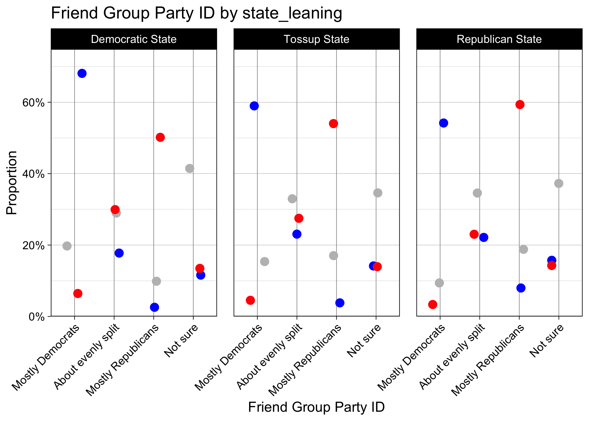
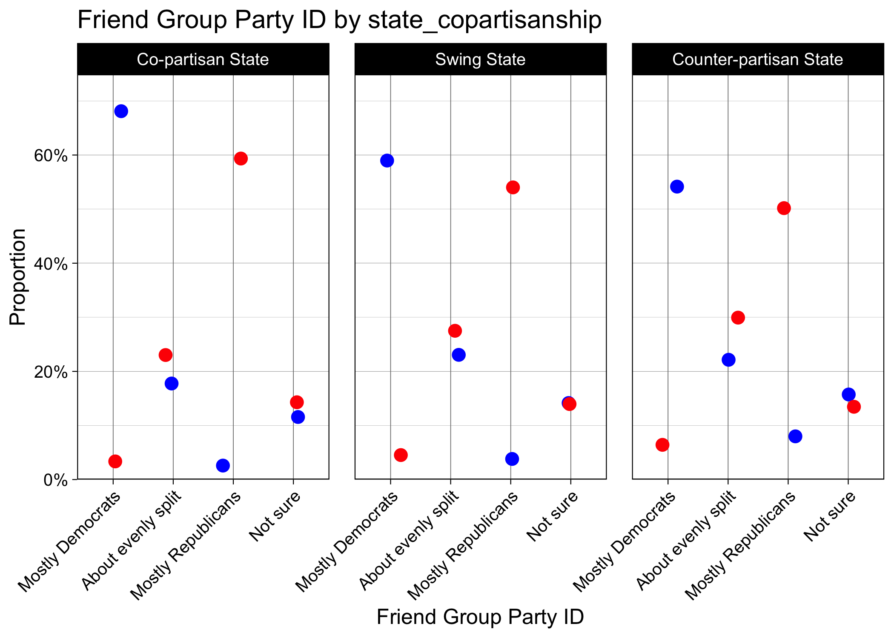

Explore Friend Group Party ID
================
Aman Choudhri
2024-09-09

In this notebook, we explore the covariate `friend_group_pid3`.

## Setup

Load the YouGov survey data (pre-processed by `process-data.R`).

``` r
CLEANED_DATA_FILENAME <- 'dat/processed.rds'

df <- readRDS(CLEANED_DATA_FILENAME)
```

Save some instance variables for use in the notebook based on the
specified plot variable (since this is an auto-generated parameterized
report).

``` r
outcome_var <- params$categorical_var
outcome_var_name <- params$cat_var_display_name
```

Also, since we’ll be using these parameters over and over again, define
a helper function so we don’t have to repeat code. For more information
on the `dot_plot_base` and `bar_plot_base` functions, see the appendix
at the bottom.

``` r
dot_plot <- function (group_var1, group_var2=NULL) {
  return(dot_plot_base(df, outcome_var, outcome_var_name, group_var1, group_var2))
}
bar_plot <- function (group_var1, group_var2=NULL) {
  return(bar_plot_base(df, outcome_var, outcome_var_name, group_var1, group_var2))
}
```

# Analysis

## Personal Party ID

Start by plotting friend_group_pid3 by a person’s individual party ID.

``` r
dot_plot('collapsed_pid')
```

<!-- -->

Also display in bar plot format, since that can be more legible for some
outcome measures.

``` r
bar_plot('collapsed_pid')
```

<!-- -->

## Self-Reported Social Class

``` r
dot_plot('social_class')
```

<!-- -->

## By State Partisan Leaning

Let’s create a rough analysis by state. Splitting states into D, R, and
swing, we’ll again display the proportions of friend group party ID.
We’ll use data from the Cook Political Report. To simplify the analysis,
we won’t consider the congressional districts in Maine and Nebraska
separately. We mark Maine as D, and Nebraska as R.

``` r
cook_ratings <- read.csv('dat/cook_political_report_ratings.csv')

# remove maine and nebraska's congressional districts
cook_ratings <- cook_ratings[cook_ratings$state %in% state.name,]

# collapse "leans" and "likelies" down to hard D/R/Tossup
cook_ratings <- cook_ratings %>%
  mutate(
    category = case_when(
      str_detect(category, "D$") ~ "Democratic State",
      str_detect(category, "R$") ~ "Republican State",
      TRUE ~ "Tossup State"
    ) %>%
      factor(levels = c("Democratic State", "Tossup State", "Republican State"))
  )

# add into the df
df <- merge(df, cook_ratings, by.x='inputstate', by.y='state')
# rename column
df$state_leaning <- df$category
```

Let’s examine how copartisanship varies by individual PID and state
leaning.

``` r
dot_plot('collapsed_pid', 'state_leaning')
```

<!-- -->

To facilitate comparison between Democrats in blue states and
Republicans in red states, we’ll also create a new column indicating
whether a state’s leaning is “co-partisan” with an individual person’s
party ID. So `state_copartisananship` for a Democrat living in a
Democratic state would be “Co-partisan”, but a Republican living in the
same state would have the value “Counter-partisan”.

``` r
copartisanship_mapping <- paste(c("Co-partisan", "Swing", "Counter-partisan"), "State")
df$state_copartisanship <- ifelse(
  df$collapsed_pid == "Democrat",
  copartisanship_mapping[as.numeric(df$state_leaning)],
  rev(copartisanship_mapping)[as.numeric(df$state_leaning)]
)
df$state_copartisanship <- factor(df$state_copartisanship, levels=copartisanship_mapping)
df[df$collapsed_pid == "Independent/Not sure", "state_copartisanship"] <- NA

knitr::kable(
  df %>% select(collapsed_pid, state_leaning, state_copartisanship) %>%
    rename(individual_party_id=collapsed_pid) %>%
    slice_head(n=5)
)
```

| individual_party_id  | state_leaning    | state_copartisanship   |
|:---------------------|:-----------------|:-----------------------|
| Democrat             | Republican State | Counter-partisan State |
| Independent/Not sure | Republican State | NA                     |
| Republican           | Republican State | Co-partisan State      |
| Democrat             | Republican State | Counter-partisan State |
| Republican           | Republican State | Co-partisan State      |

``` r
dot_plot('collapsed_pid', 'state_copartisanship')
```

<!-- -->

## By County Partisan Leaning

We can get more granular: county-level information.

In `process-data.R`, we impute county information based on the ZIP code
in which the respondent said they currently lived.

We split them into D, R, and swing based on their vote proportions in
the 2020 election. Note: Alaska and Rhode island do NOT have sub-state
level vote share information available from the MIT election lab, so we
treat the whole state as “County”.

First, load in the county leanings information.

``` r
# created in `county_leanings.Rmd`
county_leanings <- read.csv('dat/county-partisan-leanings.csv')
knitr::kable(
  county_leanings %>%
    mutate(state=str_to_sentence(state), county_name=str_to_sentence(county_name)) %>%
    slice_head(n=5),
  digits=3
  )
```

|   X | state   | county_name | population | total_votes | proportion_democrat | tercile |
|----:|:--------|:------------|-----------:|------------:|--------------------:|--------:|
|   1 | Alabama | Autauga     |      58805 |       27341 |               0.274 |       1 |
|   2 | Alabama | Baldwin     |     231767 |      108122 |               0.227 |       1 |
|   3 | Alabama | Barbour     |      25223 |       10438 |               0.461 |       0 |
|   4 | Alabama | Bibb        |      22293 |        9511 |               0.209 |       1 |
|   5 | Alabama | Blount      |      59134 |       27351 |               0.097 |       1 |

Merge it into `df`.

``` r
# merge these `terciles` in based on state and county name
df <- df %>% mutate(state_upper = toupper(inputstate), county_upper=toupper(county)) %>%
  left_join(
    county_leanings,
    by=c("state_upper"="state", "county_upper"="county_name")
  )

county_leaning_labels <- paste(c("Democrat", "Swing", "Republican"), "County")
df$county_leaning <- factor(county_leaning_labels[df$tercile + 2], levels=county_leaning_labels)
```

``` r
knitr::kable(
  df %>% select(collapsed_pid, inputstate, county, proportion_democrat, county_leaning) %>%
    rename(state=inputstate, individual_party_id=collapsed_pid) %>%
    slice_head(n=5),
  digits=3
  )
```

| individual_party_id  | state   | county    | proportion_democrat | county_leaning    |
|:---------------------|:--------|:----------|--------------------:|:------------------|
| Democrat             | Alabama | Mobile    |               0.440 | Republican County |
| Independent/Not sure | Alabama | Calhoun   |               0.302 | Republican County |
| Republican           | Alabama | Jefferson |               0.567 | Democrat County   |
| Democrat             | Alabama | Marshall  |               0.152 | Republican County |
| Republican           | Alabama | Dale      |               0.265 | Republican County |

Now plot it.

``` r
dot_plot('collapsed_pid', 'county_leaning')
```

<!-- -->

Similarly, we now create a new covariate indicating the
“co-partisanship” of a county, just like above with states.

``` r
copartisanship_mapping <- paste(c("Co-partisan", "Swing", "Counter-partisan"), "County")
df$county_copartisanship <- ifelse(
  df$collapsed_pid == "Democrat",
  copartisanship_mapping[df$tercile + 2],
  rev(copartisanship_mapping)[df$tercile + 2]
)
df$county_copartisanship <- factor(df$county_copartisanship, levels=copartisanship_mapping)
df[df$collapsed_pid == "Independent/Not sure", "county_copartisanship"] <- NA

knitr::kable(
  df %>% select(collapsed_pid, county_leaning, county_copartisanship) %>%
    rename(individual_party_id=collapsed_pid) %>%
    slice_head(n=5)
)
```

| individual_party_id  | county_leaning    | county_copartisanship   |
|:---------------------|:------------------|:------------------------|
| Democrat             | Republican County | Counter-partisan County |
| Independent/Not sure | Republican County | NA                      |
| Republican           | Democrat County   | Counter-partisan County |
| Democrat             | Republican County | Counter-partisan County |
| Republican           | Republican County | Co-partisan County      |

``` r
dot_plot('collapsed_pid', 'county_copartisanship')
```

<!-- -->

## By Urbanicity

The above are more granular information about locality, but we also do
have information about the urbanicity of the respondent’s area. We’ll
analyze it here.

``` r
bar_plot('urbanicity')
```

<!-- -->

Let’s interact personal PID and urbanicity.

``` r
dot_plot('collapsed_pid', 'urbanicity')
```

<!-- -->

## Appendix

``` r
library(dplyr)
library(ggplot2)
library(stringr)
```

``` r
bar_plot_base <- function(
    data,
    categorical_plot_var,
    categorical_plot_var_name,
    group_var1,
    group_var2 = NULL
    ) {
  # Ensure categorical_plot_var is a string
  categorical_plot_var <- as.character(categorical_plot_var)
  
  # Drop rows where categorical_plot_var is null
  data <- data[!is.na(df[categorical_plot_var]),]
  
  five_level_partisan_colors <- c("blue", "lightblue", "purple", "pink", "red", "grey")
  five_level_nonpartisan_colors <- c('#ffffcc','#a1dab4','#41b6c4','#2c7fb8','#253494', "grey")
  
  color_palettes <- list(
    friend_group_pid3 = c("blue", "purple", "red", "grey"),
    friend_group_pid5 = five_level_partisan_colors,
    friend_group_copartisanship = five_level_nonpartisan_colors,
    # colors created using ColorBrewer 2.0
    # https://colorbrewer2.org/?type=sequential&scheme=YlGnBu&n=5
    friend_group_class = five_level_nonpartisan_colors
  )
  
  # Select the appropriate color palette
  if (!categorical_plot_var %in% names(color_palettes)) {
    stop(paste("No color palette defined for", categorical_plot_var))
  }
  colors <- color_palettes[[categorical_plot_var]]
  
  # Create the grouping expression
  if (is.null(group_var2)) {
    group_vars <- c(as.character(group_var1))
    facet_formula <- as.formula(paste("~", quo_name(group_var1)))
  } else {
    group_vars <- c(as.character(group_var1), as.character(group_var2))
    facet_formula <- as.formula(paste(quo_name(group_var2), "~", quo_name(group_var1)))
  }
  
  # Prepare the data
  plot_data <- data %>%
    group_by(across(all_of(c(group_vars, categorical_plot_var)))) %>%
    summarise(count = n(), .groups = "drop_last") %>%
    mutate(proportion = count / sum(count))
  
  # Create the plot
  p <- ggplot(plot_data, aes(y = !!sym(categorical_plot_var), x = proportion)) +
    geom_bar(stat = "identity", aes(fill = !!sym(categorical_plot_var))) +
    facet_grid(facet_formula) +
    labs(
        title = paste(
          categorical_plot_var_name,
          "by",
          group_var1,
          if(!is.null(group_var2)) paste("and", group_var2)
          ),
         y = categorical_plot_var_name,
         x = "Proportion") +
         # fill = categorical_plot_var_name) +
    scale_x_continuous(labels = scales::percent_format()) +
    scale_y_discrete(limits = rev(levels(plot_data[[categorical_plot_var]]))) +
    theme_minimal() +
    theme(axis.text.x = element_text(angle = 45, hjust = 1))
  
  # Add color scale if colors are provided
  if (!missing(colors)) {
    p <- p + scale_fill_manual(values = colors, guide="none")
  }
  
  return(p)
}
```

``` r
dot_plot_base <- function(
    data,
    categorical_plot_var,
    categorical_plot_var_name,
    group_var1,
    group_var2 = NULL,
    remove_na_var1_rows=T,
    remove_na_var2_rows=T,
    title=NULL
  ) {
  three_level_partisan_colors <- c("blue", "grey", "red")
  collapsed_pid_colors <- three_level_partisan_colors
  names(collapsed_pid_colors) <- c("Democrat", "Independent/Not sure", "Republican")
  
  
  four_level_nonpartisan_colors <- c('#7b3294','#c2a5cf','#a6dba0','#008837')
  # four_level_nonpartisan_colors <- c('#a6611a','#dfc27d','#80cdc1','#018571')
  # four_level_nonpartisan_colors <- rev(c('#ffffcc','#a1dab4','#41b6c4','#225ea8'))
  social_class_colors <- four_level_nonpartisan_colors
  names(social_class_colors) <- c("Working class", "Middle class", "Upper middle class", "Wealthy")
  
  color_palettes <- list(
    collapsed_pid = collapsed_pid_colors,
    social_class = social_class_colors
  )
  
  # Select the appropriate color palette
  if (!group_var1 %in% names(color_palettes)) {
    stop(paste("No color palette defined for", group_var1))
  }
  
  colors <- color_palettes[[group_var1]]
  
  
  # Create the grouping expression
  if (is.null(group_var2)) {
    group_vars <- c(as.character(group_var1))
  } else {
    group_vars <- c(as.character(group_var1), as.character(group_var2))
    # drop rows where group_var2 is NA
    data <- data %>% filter(!is.na(!!sym(group_var2)))
  }
  
  # Filter NA rows if appropriate
  filter_expr = T
  if (remove_na_var1_rows) {
    filter_expr <- filter_expr & !is.na(data[group_var1])
  }
  if (remove_na_var2_rows) {
    filter_expr <- filter_expr & !is.na(data[group_var1])
  }
  
  # Prepare the data
  plot_data <- data %>%
    filter(!is.na(!!sym(categorical_plot_var)) & filter_expr) %>%
    group_by(across(all_of(c(group_vars, categorical_plot_var)))) %>%
    summarise(count = n(), .groups = "drop_last") %>%
    mutate(proportion = count / sum(count))
  
  p <- ggplot(plot_data, aes(x = !!sym(categorical_plot_var), y = proportion)) +
    geom_hline(yintercept = 0, linetype = "solid", color = "gray50") +
    geom_point(
      stat = "identity",
      position=position_jitter(width=0.2),
      aes(colour = !!sym(group_var1)),
      size=3,
      ) +
    scale_color_manual(values=colors) +
    scale_y_continuous(labels = scales::percent_format(), expand=expansion(mult=c(0,0.1))) +
    theme_linedraw() +
    theme(
      text = element_text(size=12),
      axis.text.x = element_text(angle = 45, hjust = 1),
      panel.grid.major.x = element_line(color = "grey50", linewidth=0.2)
      ) + 
    labs(
        title = paste(
          categorical_plot_var_name,
          if(!is.null(group_var2)) paste("by", group_var2)
          ),
         x = categorical_plot_var_name,
         y = "Proportion")
  
  if(group_var1 != "social_class") {
    p <- p + guides(colour=FALSE)
  }
  
  if (!is.null(group_var2)) {
    facet_expr <- as.formula(paste(". ~", quo_name(group_var2)))
    p <- p + facet_grid(facet_expr) + theme(panel.spacing = unit(0.5, "cm"))
  }
  return(p)
}
```
