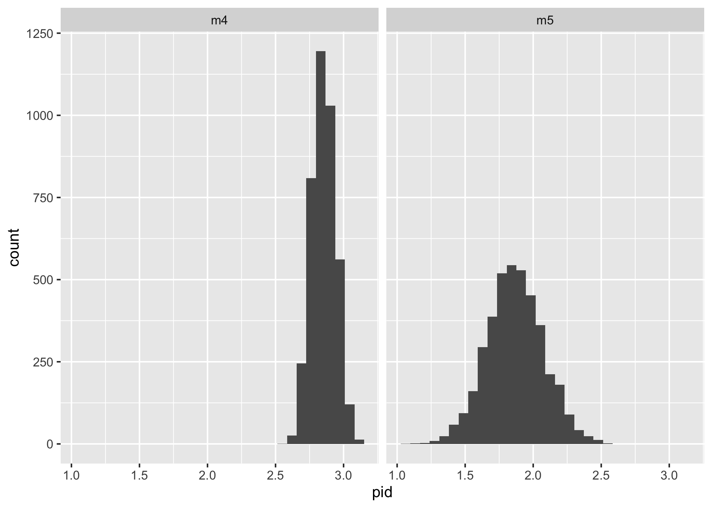

Regressing Vote on Covariates
================
Aman Choudhri
2024-10-22

``` r
library(dplyr)
library(ggplot2)
library(stringr)
library(patchwork)

library(arm)
library(rstanarm)
```

In this notebook, we regress individuals’ votes on covariates like their
individual partisan leanings, the partisan leanings of their
state/county, the copartisanship of their friend groups, etc.

First set up our data.

``` r
CLEANED_DATA_FILENAME <- 'dat/processed.rds'

df <- readRDS(CLEANED_DATA_FILENAME)
```

Load in county-level voteshares from 2020.

``` r
county_leanings <- read.csv('dat/county-partisan-leanings.csv')
county_leanings <- county_leanings %>% rename(county_p_dem=proportion_democrat)
knitr::kable(
  county_leanings %>%
    mutate(state=str_to_sentence(state), county_name=str_to_sentence(county_name)) %>%
    slice_head(n=5),
  digits=3
  )
```

|   X | state   | county_name | population | total_votes | county_p_dem | tercile |
|----:|:--------|:------------|-----------:|------------:|-------------:|--------:|
|   1 | Alabama | Autauga     |      58805 |       27341 |        0.274 |       1 |
|   2 | Alabama | Baldwin     |     231767 |      108122 |        0.227 |       1 |
|   3 | Alabama | Barbour     |      25223 |       10438 |        0.461 |       0 |
|   4 | Alabama | Bibb        |      22293 |        9511 |        0.209 |       1 |
|   5 | Alabama | Blount      |      59134 |       27351 |        0.097 |       1 |

Also aggregate up and calculate state leanings.

``` r
state_leanings <- county_leanings %>%
  group_by(state) %>%
  mutate(frac_state_votes=total_votes/sum(total_votes)) %>%
  summarize(state_p_dem = sum(county_p_dem * frac_state_votes))

knitr::kable(
  state_leanings %>%
    mutate(state=str_to_sentence(state)) %>%
    slice_head(n=10),
  digits=3
  )
```

| state                | state_p_dem |
|:---------------------|------------:|
| Alabama              |       0.371 |
| Alaska               |       0.447 |
| Arizona              |       0.502 |
| Arkansas             |       0.358 |
| California           |       0.649 |
| Colorado             |       0.569 |
| Connecticut          |       0.602 |
| Delaware             |       0.596 |
| District of columbia |       0.945 |
| Florida              |       0.483 |

And merge both into `df`.

``` r
df <- df %>% mutate(state_upper = toupper(inputstate), county_upper=toupper(county)) %>%
  left_join(
    county_leanings,
    by=c("state_upper"="state", "county_upper"="county_name")
  ) %>%
  left_join(
    state_leanings,
    by=c("state_upper"="state")
  ) %>% mutate(
    state_p_rep = 1 - state_p_dem,
    county_p_rep = 1 - county_p_dem
  )
```

``` r
display_df(df)  # function definition in Appendix
```

| party_id | vote_in_2020 | state        | county     | state_p_rep | county_p_rep |
|:---------|:-------------|:-------------|:-----------|------------:|-------------:|
| D        | D            | Colorado     | Boulder    |       0.431 |        0.211 |
| R        | R            | Ohio         | Cuyahoga   |       0.541 |        0.328 |
| D        | D            | Washington   | King       |       0.401 |        0.229 |
| R        | R            | Minnesota    | Hennepin   |       0.464 |        0.279 |
| D        | D            | Oklahoma     | Grady      |       0.669 |        0.817 |
| D        | D            | California   | Humboldt   |       0.351 |        0.327 |
| R        | R            | Pennsylvania | Washington |       0.494 |        0.615 |
| I        | Other/NA     | Vermont      | Chittenden |       0.317 |        0.219 |
| I        | R            | Florida      | Pinellas   |       0.517 |        0.499 |
| R        | Other/NA     | Virginia     | Suffolk    |       0.448 |           NA |

For the regressions, we’ll convert the `friend_group_pid5` variable into
a numeric score from -2 to 2 (All Democrats, …, All Republicans). We’ll
collapse respondents who marked “Not sure” into the same bucket as those
who marked “About evenly split”.

``` r
df <- df %>% mutate(
  friend_group_pid = ifelse(friend_group_pid5 == "Not sure", 0, as.numeric(friend_group_pid5) - 3),
)
df %>% dplyr::select(friend_group_pid5, friend_group_pid)
```

    ## # A tibble: 5,891 × 2
    ##    friend_group_pid5  friend_group_pid
    ##    <fct>                         <dbl>
    ##  1 Mostly Democrats                 -1
    ##  2 Not sure                          0
    ##  3 Mostly Democrats                 -1
    ##  4 Mostly Republicans                1
    ##  5 Not sure                          0
    ##  6 Mostly Democrats                 -1
    ##  7 About evenly split                0
    ##  8 Not sure                          0
    ##  9 Not sure                          0
    ## 10 Not sure                          0
    ## # ℹ 5,881 more rows

## Predicting 2020 Vote

For simplicity, restrict to only people who voted in 2020, and only
those who voted for Trump/Biden.

``` r
print(paste0(
  '# of people who didn\'t vote in 2020: ',
  nrow(df %>% filter(presvote20post == "Did not vote for President"))
))
```

    ## [1] "# of people who didn't vote in 2020: 651"

``` r
voted_d_or_r <- 
print(paste0(
  '# of people who voted third-party in 2020: ',
  nrow(df %>% filter(
    presvote20post != "Did not vote for President",
    !(presvote20post %in% c("Donald Trump", "Joe Biden"))
    )
    )
))
```

    ## [1] "# of people who voted third-party in 2020: 261"

``` r
restricted <- df %>%
  filter(presvote20post %in% c("Donald Trump", "Joe Biden")) %>%
  mutate(
    vote = ifelse(presvote20post == "Donald Trump", 1, 0),
    pid = as.numeric(collapsed_pid) - 2,
    state_p_rep = 1 - state_p_dem,
    county_p_rep = 1 - county_p_dem,
  )
knitr::kable(
  restricted %>%
    dplyr::select(
      pid, friend_group_pid, vote, inputstate,
      county, state_p_rep, county_p_rep
      ) %>% 
    rename(state=inputstate) %>%
    slice_head(n=5),
  digits=3
)
```

| pid | friend_group_pid | vote | state      | county   | state_p_rep | county_p_rep |
|----:|-----------------:|-----:|:-----------|:---------|------------:|-------------:|
|  -1 |               -1 |    0 | Colorado   | Boulder  |       0.431 |        0.211 |
|   1 |                0 |    1 | Ohio       | Cuyahoga |       0.541 |        0.328 |
|  -1 |               -1 |    0 | Washington | King     |       0.401 |        0.229 |
|   1 |                1 |    1 | Minnesota  | Hennepin |       0.464 |        0.279 |
|  -1 |                0 |    0 | Oklahoma   | Grady    |       0.669 |        0.817 |

### Model 1: State Leaning

``` r
model_1 <- stan_glm(vote ~ state_p_rep, data=restricted, family=binomial, refresh=0)
```

``` r
summary(model_1)
```

    ## 
    ## Model Info:
    ##  function:     stan_glm
    ##  family:       binomial [logit]
    ##  formula:      vote ~ state_p_rep
    ##  algorithm:    sampling
    ##  sample:       4000 (posterior sample size)
    ##  priors:       see help('prior_summary')
    ##  observations: 4969
    ##  predictors:   2
    ## 
    ## Estimates:
    ##               mean   sd   10%   50%   90%
    ## (Intercept) -1.8    0.2 -2.1  -1.8  -1.6 
    ## state_p_rep  3.7    0.3  3.3   3.7   4.2 
    ## 
    ## Fit Diagnostics:
    ##            mean   sd   10%   50%   90%
    ## mean_PPD 0.5    0.0  0.5   0.5   0.5  
    ## 
    ## The mean_ppd is the sample average posterior predictive distribution of the outcome variable (for details see help('summary.stanreg')).
    ## 
    ## MCMC diagnostics
    ##               mcse Rhat n_eff
    ## (Intercept)   0.0  1.0  2508 
    ## state_p_rep   0.0  1.0  2667 
    ## mean_PPD      0.0  1.0  3137 
    ## log-posterior 0.0  1.0  1725 
    ## 
    ## For each parameter, mcse is Monte Carlo standard error, n_eff is a crude measure of effective sample size, and Rhat is the potential scale reduction factor on split chains (at convergence Rhat=1).

Interpreting these coefficients using the “divide by 4 trick”, we learn
that a 0.1-unit Republican shift in state vote share will in expectation
raise the probability of an individual voting Republican by 0.38 / 4 =
0.095.

### Model 2: County

``` r
model_2 <- stan_glm(vote ~ state_p_rep + county_p_rep, data=restricted, family=binomial, refresh=0)
```

``` r
summary(model_2)
```

    ## 
    ## Model Info:
    ##  function:     stan_glm
    ##  family:       binomial [logit]
    ##  formula:      vote ~ state_p_rep + county_p_rep
    ##  algorithm:    sampling
    ##  sample:       4000 (posterior sample size)
    ##  priors:       see help('prior_summary')
    ##  observations: 4727
    ##  predictors:   3
    ## 
    ## Estimates:
    ##                mean   sd   10%   50%   90%
    ## (Intercept)  -2.0    0.2 -2.2  -2.0  -1.7 
    ## state_p_rep   0.6    0.4  0.1   0.6   1.1 
    ## county_p_rep  3.3    0.2  3.0   3.3   3.6 
    ## 
    ## Fit Diagnostics:
    ##            mean   sd   10%   50%   90%
    ## mean_PPD 0.5    0.0  0.5   0.5   0.5  
    ## 
    ## The mean_ppd is the sample average posterior predictive distribution of the outcome variable (for details see help('summary.stanreg')).
    ## 
    ## MCMC diagnostics
    ##               mcse Rhat n_eff
    ## (Intercept)   0.0  1.0  3784 
    ## state_p_rep   0.0  1.0  2607 
    ## county_p_rep  0.0  1.0  2600 
    ## mean_PPD      0.0  1.0  3753 
    ## log-posterior 0.0  1.0  1733 
    ## 
    ## For each parameter, mcse is Monte Carlo standard error, n_eff is a crude measure of effective sample size, and Rhat is the potential scale reduction factor on split chains (at convergence Rhat=1).

Interpreting these coefficients, it seems that state Republican
voteshare has a much more modest relationship with an individual’s
propensity to vote Republican, after adjusting for county information.
Now, a 10 percentage point increase in Republican voteshare will in
expectation mean an increase of 1.75 percentage points in the
probability of voting Republican.

The much stronger correlation, as expected is with county Republican
voteshare. Repeating the same divide by four trick, a 10pp increase in
county Republican voteshare will in expectation correspond to a 8.25pp
increase in probability of having voted Republican in 2020.

### Model 3: Friend Group Partisanship

``` r
model_3 <- stan_glm(
  vote ~ state_p_rep + county_p_rep + friend_group_pid,
  data=restricted, family=binomial, refresh=0
  )
```

``` r
summary(model_3)
```

    ## 
    ## Model Info:
    ##  function:     stan_glm
    ##  family:       binomial [logit]
    ##  formula:      vote ~ state_p_rep + county_p_rep + friend_group_pid
    ##  algorithm:    sampling
    ##  sample:       4000 (posterior sample size)
    ##  priors:       see help('prior_summary')
    ##  observations: 4727
    ##  predictors:   4
    ## 
    ## Estimates:
    ##                    mean   sd   10%   50%   90%
    ## (Intercept)      -0.4    0.2 -0.7  -0.4  -0.1 
    ## state_p_rep       0.0    0.5 -0.6   0.0   0.7 
    ## county_p_rep      1.0    0.3  0.6   1.0   1.3 
    ## friend_group_pid  2.1    0.1  2.0   2.1   2.1 
    ## 
    ## Fit Diagnostics:
    ##            mean   sd   10%   50%   90%
    ## mean_PPD 0.5    0.0  0.5   0.5   0.5  
    ## 
    ## The mean_ppd is the sample average posterior predictive distribution of the outcome variable (for details see help('summary.stanreg')).
    ## 
    ## MCMC diagnostics
    ##                  mcse Rhat n_eff
    ## (Intercept)      0.0  1.0  4257 
    ## state_p_rep      0.0  1.0  3087 
    ## county_p_rep     0.0  1.0  3286 
    ## friend_group_pid 0.0  1.0  3662 
    ## mean_PPD         0.0  1.0  3882 
    ## log-posterior    0.0  1.0  1889 
    ## 
    ## For each parameter, mcse is Monte Carlo standard error, n_eff is a crude measure of effective sample size, and Rhat is the potential scale reduction factor on split chains (at convergence Rhat=1).

As expected, the state-level information adds minimal predictive power.
Interestingly, county Republican voteshare still seems to predict vote
after adjusting for friend group partisanship. A 10pp Republican shift
in county voteshare will in expectation result in a 2.5pp increase in
the probability of an individual having voted Republican.

With friend group partisanship, the interpretation of the coefficient is
that a one-unit Republican shift in friend group partisan composition
(i.e. from “All Democrats” to “Mostly Democrats”) will *at maximum*
correspond to a whopping 52pp increase in probability of voting
Republican. This figure is primarily meaningful around the center,
representing shifts in friend group partisanship between “Mostly
Democrat”, “About evenly split”, and “Mostly Republican”.

### Model 4: Individual Party ID

Finally, incorporate individual party ID into the model.

``` r
model_4 <- stan_glm(
  vote ~ state_p_rep + county_p_rep + friend_group_pid + pid,
  data=restricted, family=binomial, refresh=0
  )
```

``` r
summary(model_4)
```

    ## 
    ## Model Info:
    ##  function:     stan_glm
    ##  family:       binomial [logit]
    ##  formula:      vote ~ state_p_rep + county_p_rep + friend_group_pid + pid
    ##  algorithm:    sampling
    ##  sample:       4000 (posterior sample size)
    ##  priors:       see help('prior_summary')
    ##  observations: 4727
    ##  predictors:   5
    ## 
    ## Estimates:
    ##                    mean   sd   10%   50%   90%
    ## (Intercept)      -0.2    0.4 -0.6  -0.2   0.3 
    ## state_p_rep      -0.4    0.9 -1.5  -0.4   0.6 
    ## county_p_rep      0.9    0.5  0.3   0.9   1.5 
    ## friend_group_pid  0.9    0.1  0.8   0.9   1.0 
    ## pid               2.9    0.1  2.7   2.9   3.0 
    ## 
    ## Fit Diagnostics:
    ##            mean   sd   10%   50%   90%
    ## mean_PPD 0.5    0.0  0.5   0.5   0.5  
    ## 
    ## The mean_ppd is the sample average posterior predictive distribution of the outcome variable (for details see help('summary.stanreg')).
    ## 
    ## MCMC diagnostics
    ##                  mcse Rhat n_eff
    ## (Intercept)      0.0  1.0  5195 
    ## state_p_rep      0.0  1.0  3309 
    ## county_p_rep     0.0  1.0  3146 
    ## friend_group_pid 0.0  1.0  4800 
    ## pid              0.0  1.0  4558 
    ## mean_PPD         0.0  1.0  3929 
    ## log-posterior    0.0  1.0  1636 
    ## 
    ## For each parameter, mcse is Monte Carlo standard error, n_eff is a crude measure of effective sample size, and Rhat is the potential scale reduction factor on split chains (at convergence Rhat=1).

A one-unit rightward shift in `pid` (from Democrat to Independent/Other
or from I/O to Republican) will at maximum lead to an expected increase
in probability of voting Republican by 75pp. After adjusting for this,
however, friend group partisanship still seems to be strongly predictive
of vote, with a 1-unit rightward shift in friend group partisan
composition leading to a maximum of a 22.5pp increase in probability of
voting Republican.

### Model 5: More granular personal PID

Here we check the intuition that `friend_group_pid5` is maybe just a
proxy for strength of personal party identification. If it is, we might
expect that adding a more granular signal of personal party ID would
remove some predictive power from the friend group covariate.

``` r
restricted <- restricted %>% mutate(
  granular_pid=ifelse(
    pid7 == "Not sure",
    0,
    as.numeric(pid7) - 4
  )
)

knitr::kable(
  restricted %>% dplyr::select(pid7, granular_pid) %>% slice_head(n=10)
  )
```

| pid7                       | granular_pid |
|:---------------------------|-------------:|
| Lean Democrat              |           -1 |
| Not very strong Republican |            2 |
| Strong Democrat            |           -3 |
| Lean Republican            |            1 |
| Lean Democrat              |           -1 |
| Strong Democrat            |           -3 |
| Strong Republican          |            3 |
| Independent                |            0 |
| Strong Democrat            |           -3 |
| Lean Republican            |            1 |

``` r
model_5 <- stan_glm(
  vote ~ pid + friend_group_pid + state_p_rep + county_p_rep + granular_pid,
  data=restricted,
  family=binomial,
  refresh=0
)
```

``` r
summary(model_5)
```

    ## 
    ## Model Info:
    ##  function:     stan_glm
    ##  family:       binomial [logit]
    ##  formula:      vote ~ pid + friend_group_pid + state_p_rep + county_p_rep + 
    ##     granular_pid
    ##  algorithm:    sampling
    ##  sample:       4000 (posterior sample size)
    ##  priors:       see help('prior_summary')
    ##  observations: 4727
    ##  predictors:   6
    ## 
    ## Estimates:
    ##                    mean   sd   10%   50%   90%
    ## (Intercept)      -0.1    0.4 -0.6  -0.1   0.3 
    ## pid               1.9    0.2  1.6   1.9   2.1 
    ## friend_group_pid  0.9    0.1  0.8   0.9   1.0 
    ## state_p_rep      -0.5    0.8 -1.5  -0.5   0.6 
    ## county_p_rep      0.9    0.5  0.3   0.9   1.5 
    ## granular_pid      0.5    0.1  0.3   0.5   0.6 
    ## 
    ## Fit Diagnostics:
    ##            mean   sd   10%   50%   90%
    ## mean_PPD 0.5    0.0  0.5   0.5   0.5  
    ## 
    ## The mean_ppd is the sample average posterior predictive distribution of the outcome variable (for details see help('summary.stanreg')).
    ## 
    ## MCMC diagnostics
    ##                  mcse Rhat n_eff
    ## (Intercept)      0.0  1.0  4079 
    ## pid              0.0  1.0  2332 
    ## friend_group_pid 0.0  1.0  3419 
    ## state_p_rep      0.0  1.0  2846 
    ## county_p_rep     0.0  1.0  3501 
    ## granular_pid     0.0  1.0  2343 
    ## mean_PPD         0.0  1.0  3967 
    ## log-posterior    0.0  1.0  1664 
    ## 
    ## For each parameter, mcse is Monte Carlo standard error, n_eff is a crude measure of effective sample size, and Rhat is the potential scale reduction factor on split chains (at convergence Rhat=1).

Why would `pid` still have some predictive power under this model? The
`pid` variable is just a collapsed version of `granular_pid`—in fact,
`pid` shouldn’t add any information beyond `granular_pid` whatsoever.
Conceptually this might result in collinearity and hence inflated
posterior standard error, but it doesn’t really look like we see that.

Let’s visualize the posterior distribution on $\beta_{\text{pid}}$.

``` r
draws_4 <- as.data.frame(model_4$stanfit)
draws_5 <- as.data.frame(model_5$stanfit)

draws <- bind_rows(list('m4'=draws_4, 'm5'=draws_5), .id="id")
```

``` r
ggplot(draws, aes(pid)) + geom_histogram() + facet_grid(. ~ id)
```

    ## `stat_bin()` using `bins = 30`. Pick better value with `binwidth`.

<!-- -->

Let’s try without `pid` for more interpretability.

### Model 6: Granular PID only

``` r
model_6 <- stan_glm(
  vote ~ friend_group_pid + state_p_rep + county_p_rep + granular_pid,
  data=restricted,
  family=binomial,
  refresh=0
)
```

``` r
summary(model_6)
```

    ## 
    ## Model Info:
    ##  function:     stan_glm
    ##  family:       binomial [logit]
    ##  formula:      vote ~ friend_group_pid + state_p_rep + county_p_rep + granular_pid
    ##  algorithm:    sampling
    ##  sample:       4000 (posterior sample size)
    ##  priors:       see help('prior_summary')
    ##  observations: 4727
    ##  predictors:   5
    ## 
    ## Estimates:
    ##                    mean   sd   10%   50%   90%
    ## (Intercept)       0.0    0.3 -0.5   0.0   0.4 
    ## friend_group_pid  1.0    0.1  0.8   1.0   1.1 
    ## state_p_rep      -0.5    0.8 -1.5  -0.5   0.6 
    ## county_p_rep      0.8    0.4  0.3   0.8   1.4 
    ## granular_pid      1.4    0.0  1.3   1.4   1.4 
    ## 
    ## Fit Diagnostics:
    ##            mean   sd   10%   50%   90%
    ## mean_PPD 0.5    0.0  0.5   0.5   0.5  
    ## 
    ## The mean_ppd is the sample average posterior predictive distribution of the outcome variable (for details see help('summary.stanreg')).
    ## 
    ## MCMC diagnostics
    ##                  mcse Rhat n_eff
    ## (Intercept)      0.0  1.0  5488 
    ## friend_group_pid 0.0  1.0  4047 
    ## state_p_rep      0.0  1.0  3689 
    ## county_p_rep     0.0  1.0  3171 
    ## granular_pid     0.0  1.0  4448 
    ## mean_PPD         0.0  1.0  4218 
    ## log-posterior    0.0  1.0  1649 
    ## 
    ## For each parameter, mcse is Monte Carlo standard error, n_eff is a crude measure of effective sample size, and Rhat is the potential scale reduction factor on split chains (at convergence Rhat=1).

### Multilevel Structure

``` r
multilevel <- stan_glmer(
  vote ~ pid + friend_group_pid + state_p_rep + county_p_rep + (1 | inputstate),
  data=restricted,
  family=binomial
  )
```

    ## 
    ## SAMPLING FOR MODEL 'bernoulli' NOW (CHAIN 1).
    ## Chain 1: 
    ## Chain 1: Gradient evaluation took 0.000432 seconds
    ## Chain 1: 1000 transitions using 10 leapfrog steps per transition would take 4.32 seconds.
    ## Chain 1: Adjust your expectations accordingly!
    ## Chain 1: 
    ## Chain 1: 
    ## Chain 1: Iteration:    1 / 2000 [  0%]  (Warmup)
    ## Chain 1: Iteration:  200 / 2000 [ 10%]  (Warmup)
    ## Chain 1: Iteration:  400 / 2000 [ 20%]  (Warmup)
    ## Chain 1: Iteration:  600 / 2000 [ 30%]  (Warmup)
    ## Chain 1: Iteration:  800 / 2000 [ 40%]  (Warmup)
    ## Chain 1: Iteration: 1000 / 2000 [ 50%]  (Warmup)
    ## Chain 1: Iteration: 1001 / 2000 [ 50%]  (Sampling)
    ## Chain 1: Iteration: 1200 / 2000 [ 60%]  (Sampling)
    ## Chain 1: Iteration: 1400 / 2000 [ 70%]  (Sampling)
    ## Chain 1: Iteration: 1600 / 2000 [ 80%]  (Sampling)
    ## Chain 1: Iteration: 1800 / 2000 [ 90%]  (Sampling)
    ## Chain 1: Iteration: 2000 / 2000 [100%]  (Sampling)
    ## Chain 1: 
    ## Chain 1:  Elapsed Time: 12.354 seconds (Warm-up)
    ## Chain 1:                8.778 seconds (Sampling)
    ## Chain 1:                21.132 seconds (Total)
    ## Chain 1: 
    ## 
    ## SAMPLING FOR MODEL 'bernoulli' NOW (CHAIN 2).
    ## Chain 2: 
    ## Chain 2: Gradient evaluation took 0.000305 seconds
    ## Chain 2: 1000 transitions using 10 leapfrog steps per transition would take 3.05 seconds.
    ## Chain 2: Adjust your expectations accordingly!
    ## Chain 2: 
    ## Chain 2: 
    ## Chain 2: Iteration:    1 / 2000 [  0%]  (Warmup)
    ## Chain 2: Iteration:  200 / 2000 [ 10%]  (Warmup)
    ## Chain 2: Iteration:  400 / 2000 [ 20%]  (Warmup)
    ## Chain 2: Iteration:  600 / 2000 [ 30%]  (Warmup)
    ## Chain 2: Iteration:  800 / 2000 [ 40%]  (Warmup)
    ## Chain 2: Iteration: 1000 / 2000 [ 50%]  (Warmup)
    ## Chain 2: Iteration: 1001 / 2000 [ 50%]  (Sampling)
    ## Chain 2: Iteration: 1200 / 2000 [ 60%]  (Sampling)
    ## Chain 2: Iteration: 1400 / 2000 [ 70%]  (Sampling)
    ## Chain 2: Iteration: 1600 / 2000 [ 80%]  (Sampling)
    ## Chain 2: Iteration: 1800 / 2000 [ 90%]  (Sampling)
    ## Chain 2: Iteration: 2000 / 2000 [100%]  (Sampling)
    ## Chain 2: 
    ## Chain 2:  Elapsed Time: 11.97 seconds (Warm-up)
    ## Chain 2:                8.483 seconds (Sampling)
    ## Chain 2:                20.453 seconds (Total)
    ## Chain 2: 
    ## 
    ## SAMPLING FOR MODEL 'bernoulli' NOW (CHAIN 3).
    ## Chain 3: 
    ## Chain 3: Gradient evaluation took 0.000305 seconds
    ## Chain 3: 1000 transitions using 10 leapfrog steps per transition would take 3.05 seconds.
    ## Chain 3: Adjust your expectations accordingly!
    ## Chain 3: 
    ## Chain 3: 
    ## Chain 3: Iteration:    1 / 2000 [  0%]  (Warmup)
    ## Chain 3: Iteration:  200 / 2000 [ 10%]  (Warmup)
    ## Chain 3: Iteration:  400 / 2000 [ 20%]  (Warmup)
    ## Chain 3: Iteration:  600 / 2000 [ 30%]  (Warmup)
    ## Chain 3: Iteration:  800 / 2000 [ 40%]  (Warmup)
    ## Chain 3: Iteration: 1000 / 2000 [ 50%]  (Warmup)
    ## Chain 3: Iteration: 1001 / 2000 [ 50%]  (Sampling)
    ## Chain 3: Iteration: 1200 / 2000 [ 60%]  (Sampling)
    ## Chain 3: Iteration: 1400 / 2000 [ 70%]  (Sampling)
    ## Chain 3: Iteration: 1600 / 2000 [ 80%]  (Sampling)
    ## Chain 3: Iteration: 1800 / 2000 [ 90%]  (Sampling)
    ## Chain 3: Iteration: 2000 / 2000 [100%]  (Sampling)
    ## Chain 3: 
    ## Chain 3:  Elapsed Time: 12.037 seconds (Warm-up)
    ## Chain 3:                7.911 seconds (Sampling)
    ## Chain 3:                19.948 seconds (Total)
    ## Chain 3: 
    ## 
    ## SAMPLING FOR MODEL 'bernoulli' NOW (CHAIN 4).
    ## Chain 4: 
    ## Chain 4: Gradient evaluation took 0.000318 seconds
    ## Chain 4: 1000 transitions using 10 leapfrog steps per transition would take 3.18 seconds.
    ## Chain 4: Adjust your expectations accordingly!
    ## Chain 4: 
    ## Chain 4: 
    ## Chain 4: Iteration:    1 / 2000 [  0%]  (Warmup)
    ## Chain 4: Iteration:  200 / 2000 [ 10%]  (Warmup)
    ## Chain 4: Iteration:  400 / 2000 [ 20%]  (Warmup)
    ## Chain 4: Iteration:  600 / 2000 [ 30%]  (Warmup)
    ## Chain 4: Iteration:  800 / 2000 [ 40%]  (Warmup)
    ## Chain 4: Iteration: 1000 / 2000 [ 50%]  (Warmup)
    ## Chain 4: Iteration: 1001 / 2000 [ 50%]  (Sampling)
    ## Chain 4: Iteration: 1200 / 2000 [ 60%]  (Sampling)
    ## Chain 4: Iteration: 1400 / 2000 [ 70%]  (Sampling)
    ## Chain 4: Iteration: 1600 / 2000 [ 80%]  (Sampling)
    ## Chain 4: Iteration: 1800 / 2000 [ 90%]  (Sampling)
    ## Chain 4: Iteration: 2000 / 2000 [100%]  (Sampling)
    ## Chain 4: 
    ## Chain 4:  Elapsed Time: 12.58 seconds (Warm-up)
    ## Chain 4:                7.866 seconds (Sampling)
    ## Chain 4:                20.446 seconds (Total)
    ## Chain 4:

``` r
summary(multilevel)
```

    ## 
    ## Model Info:
    ##  function:     stan_glmer
    ##  family:       binomial [logit]
    ##  formula:      vote ~ pid + friend_group_pid + state_p_rep + county_p_rep + 
    ##     (1 | inputstate)
    ##  algorithm:    sampling
    ##  sample:       4000 (posterior sample size)
    ##  priors:       see help('prior_summary')
    ##  observations: 4727
    ##  groups:       inputstate (48)
    ## 
    ## Estimates:
    ##                                                  mean   sd   10%   50%   90%
    ## (Intercept)                                    -0.2    0.4 -0.7  -0.2   0.3 
    ## pid                                             2.9    0.1  2.8   2.9   3.0 
    ## friend_group_pid                                0.9    0.1  0.8   0.9   1.0 
    ## state_p_rep                                    -0.5    0.9 -1.6  -0.5   0.6 
    ## county_p_rep                                    0.9    0.4  0.4   0.9   1.5 
    ## b[(Intercept) inputstate:Alabama]               0.0    0.1 -0.1   0.0   0.1 
    ## b[(Intercept) inputstate:Arizona]               0.0    0.1 -0.1   0.0   0.2 
    ## b[(Intercept) inputstate:Arkansas]              0.0    0.1 -0.1   0.0   0.1 
    ## b[(Intercept) inputstate:California]            0.0    0.1 -0.1   0.0   0.1 
    ## b[(Intercept) inputstate:Colorado]              0.0    0.1 -0.1   0.0   0.1 
    ## b[(Intercept) inputstate:Delaware]              0.0    0.1 -0.1   0.0   0.1 
    ## b[(Intercept) inputstate:District_of_Columbia]  0.0    0.1 -0.1   0.0   0.1 
    ## b[(Intercept) inputstate:Florida]               0.0    0.1 -0.1   0.0   0.1 
    ## b[(Intercept) inputstate:Georgia]               0.0    0.1 -0.2   0.0   0.1 
    ## b[(Intercept) inputstate:Hawaii]                0.0    0.1 -0.2   0.0   0.1 
    ## b[(Intercept) inputstate:Idaho]                 0.0    0.1 -0.2   0.0   0.1 
    ## b[(Intercept) inputstate:Illinois]              0.0    0.1 -0.1   0.0   0.2 
    ## b[(Intercept) inputstate:Indiana]               0.0    0.1 -0.1   0.0   0.1 
    ## b[(Intercept) inputstate:Iowa]                  0.0    0.1 -0.1   0.0   0.1 
    ## b[(Intercept) inputstate:Kansas]                0.0    0.1 -0.1   0.0   0.1 
    ## b[(Intercept) inputstate:Kentucky]              0.0    0.1 -0.1   0.0   0.1 
    ## b[(Intercept) inputstate:Louisiana]             0.0    0.1 -0.1   0.0   0.1 
    ## b[(Intercept) inputstate:Maine]                 0.0    0.1 -0.1   0.0   0.2 
    ## b[(Intercept) inputstate:Maryland]              0.0    0.1 -0.1   0.0   0.2 
    ## b[(Intercept) inputstate:Massachusetts]         0.0    0.1 -0.1   0.0   0.2 
    ## b[(Intercept) inputstate:Michigan]              0.0    0.1 -0.1   0.0   0.1 
    ## b[(Intercept) inputstate:Minnesota]             0.0    0.1 -0.1   0.0   0.1 
    ## b[(Intercept) inputstate:Mississippi]           0.0    0.1 -0.1   0.0   0.2 
    ## b[(Intercept) inputstate:Missouri]              0.0    0.1 -0.1   0.0   0.2 
    ## b[(Intercept) inputstate:Montana]               0.0    0.1 -0.1   0.0   0.1 
    ## b[(Intercept) inputstate:Nebraska]              0.0    0.1 -0.2   0.0   0.1 
    ## b[(Intercept) inputstate:Nevada]                0.0    0.1 -0.1   0.0   0.1 
    ## b[(Intercept) inputstate:New_Hampshire]         0.0    0.1 -0.2   0.0   0.1 
    ## b[(Intercept) inputstate:New_Jersey]            0.0    0.1 -0.1   0.0   0.1 
    ## b[(Intercept) inputstate:New_Mexico]            0.0    0.1 -0.1   0.0   0.2 
    ## b[(Intercept) inputstate:New_York]              0.0    0.1 -0.2   0.0   0.1 
    ## b[(Intercept) inputstate:North_Carolina]        0.0    0.1 -0.1   0.0   0.2 
    ## b[(Intercept) inputstate:Ohio]                 -0.1    0.1 -0.2   0.0   0.0 
    ## b[(Intercept) inputstate:Oklahoma]              0.1    0.1 -0.1   0.0   0.2 
    ## b[(Intercept) inputstate:Oregon]                0.0    0.1 -0.1   0.0   0.1 
    ## b[(Intercept) inputstate:Pennsylvania]          0.0    0.1 -0.1   0.0   0.1 
    ## b[(Intercept) inputstate:Rhode_Island]          0.0    0.1 -0.1   0.0   0.1 
    ## b[(Intercept) inputstate:South_Carolina]        0.0    0.1 -0.1   0.0   0.1 
    ## b[(Intercept) inputstate:South_Dakota]          0.0    0.1 -0.1   0.0   0.1 
    ## b[(Intercept) inputstate:Tennessee]            -0.1    0.1 -0.2   0.0   0.1 
    ## b[(Intercept) inputstate:Texas]                 0.0    0.1 -0.1   0.0   0.1 
    ## b[(Intercept) inputstate:Utah]                  0.0    0.1 -0.1   0.0   0.1 
    ## b[(Intercept) inputstate:Vermont]               0.0    0.1 -0.2   0.0   0.1 
    ## b[(Intercept) inputstate:Virginia]              0.0    0.1 -0.2   0.0   0.1 
    ## b[(Intercept) inputstate:Washington]            0.0    0.1 -0.2   0.0   0.1 
    ## b[(Intercept) inputstate:West_Virginia]         0.0    0.1 -0.2   0.0   0.1 
    ## b[(Intercept) inputstate:Wisconsin]             0.0    0.1 -0.2   0.0   0.1 
    ## b[(Intercept) inputstate:Wyoming]               0.0    0.1 -0.1   0.0   0.1 
    ## Sigma[inputstate:(Intercept),(Intercept)]       0.0    0.0  0.0   0.0   0.0 
    ## 
    ## Fit Diagnostics:
    ##            mean   sd   10%   50%   90%
    ## mean_PPD 0.5    0.0  0.5   0.5   0.5  
    ## 
    ## The mean_ppd is the sample average posterior predictive distribution of the outcome variable (for details see help('summary.stanreg')).
    ## 
    ## MCMC diagnostics
    ##                                                mcse Rhat n_eff
    ## (Intercept)                                    0.0  1.0  5250 
    ## pid                                            0.0  1.0  6476 
    ## friend_group_pid                               0.0  1.0  7137 
    ## state_p_rep                                    0.0  1.0  5507 
    ## county_p_rep                                   0.0  1.0  6116 
    ## b[(Intercept) inputstate:Alabama]              0.0  1.0  4819 
    ## b[(Intercept) inputstate:Arizona]              0.0  1.0  5659 
    ## b[(Intercept) inputstate:Arkansas]             0.0  1.0  5563 
    ## b[(Intercept) inputstate:California]           0.0  1.0  4252 
    ## b[(Intercept) inputstate:Colorado]             0.0  1.0  5836 
    ## b[(Intercept) inputstate:Delaware]             0.0  1.0  5449 
    ## b[(Intercept) inputstate:District_of_Columbia] 0.0  1.0  4978 
    ## b[(Intercept) inputstate:Florida]              0.0  1.0  5239 
    ## b[(Intercept) inputstate:Georgia]              0.0  1.0  5406 
    ## b[(Intercept) inputstate:Hawaii]               0.0  1.0  5247 
    ## b[(Intercept) inputstate:Idaho]                0.0  1.0  5079 
    ## b[(Intercept) inputstate:Illinois]             0.0  1.0  4317 
    ## b[(Intercept) inputstate:Indiana]              0.0  1.0  4834 
    ## b[(Intercept) inputstate:Iowa]                 0.0  1.0  5306 
    ## b[(Intercept) inputstate:Kansas]               0.0  1.0  5366 
    ## b[(Intercept) inputstate:Kentucky]             0.0  1.0  5217 
    ## b[(Intercept) inputstate:Louisiana]            0.0  1.0  4812 
    ## b[(Intercept) inputstate:Maine]                0.0  1.0  4549 
    ## b[(Intercept) inputstate:Maryland]             0.0  1.0  4221 
    ## b[(Intercept) inputstate:Massachusetts]        0.0  1.0  5615 
    ## b[(Intercept) inputstate:Michigan]             0.0  1.0  4451 
    ## b[(Intercept) inputstate:Minnesota]            0.0  1.0  6003 
    ## b[(Intercept) inputstate:Mississippi]          0.0  1.0  5648 
    ## b[(Intercept) inputstate:Missouri]             0.0  1.0  4171 
    ## b[(Intercept) inputstate:Montana]              0.0  1.0  5483 
    ## b[(Intercept) inputstate:Nebraska]             0.0  1.0  5336 
    ## b[(Intercept) inputstate:Nevada]               0.0  1.0  5173 
    ## b[(Intercept) inputstate:New_Hampshire]        0.0  1.0  4879 
    ## b[(Intercept) inputstate:New_Jersey]           0.0  1.0  5598 
    ## b[(Intercept) inputstate:New_Mexico]           0.0  1.0  4200 
    ## b[(Intercept) inputstate:New_York]             0.0  1.0  4832 
    ## b[(Intercept) inputstate:North_Carolina]       0.0  1.0  4340 
    ## b[(Intercept) inputstate:Ohio]                 0.0  1.0  3603 
    ## b[(Intercept) inputstate:Oklahoma]             0.0  1.0  3598 
    ## b[(Intercept) inputstate:Oregon]               0.0  1.0  5520 
    ## b[(Intercept) inputstate:Pennsylvania]         0.0  1.0  5333 
    ## b[(Intercept) inputstate:Rhode_Island]         0.0  1.0  5069 
    ## b[(Intercept) inputstate:South_Carolina]       0.0  1.0  5429 
    ## b[(Intercept) inputstate:South_Dakota]         0.0  1.0  4892 
    ## b[(Intercept) inputstate:Tennessee]            0.0  1.0  3704 
    ## b[(Intercept) inputstate:Texas]                0.0  1.0  5426 
    ## b[(Intercept) inputstate:Utah]                 0.0  1.0  4609 
    ## b[(Intercept) inputstate:Vermont]              0.0  1.0  5722 
    ## b[(Intercept) inputstate:Virginia]             0.0  1.0  4040 
    ## b[(Intercept) inputstate:Washington]           0.0  1.0  4224 
    ## b[(Intercept) inputstate:West_Virginia]        0.0  1.0  4823 
    ## b[(Intercept) inputstate:Wisconsin]            0.0  1.0  3828 
    ## b[(Intercept) inputstate:Wyoming]              0.0  1.0  6298 
    ## Sigma[inputstate:(Intercept),(Intercept)]      0.0  1.0  2505 
    ## mean_PPD                                       0.0  1.0  5134 
    ## log-posterior                                  0.1  1.0  1525 
    ## 
    ## For each parameter, mcse is Monte Carlo standard error, n_eff is a crude measure of effective sample size, and Rhat is the potential scale reduction factor on split chains (at convergence Rhat=1).

## Appendix

### Utility functions

### Model diagnostics
